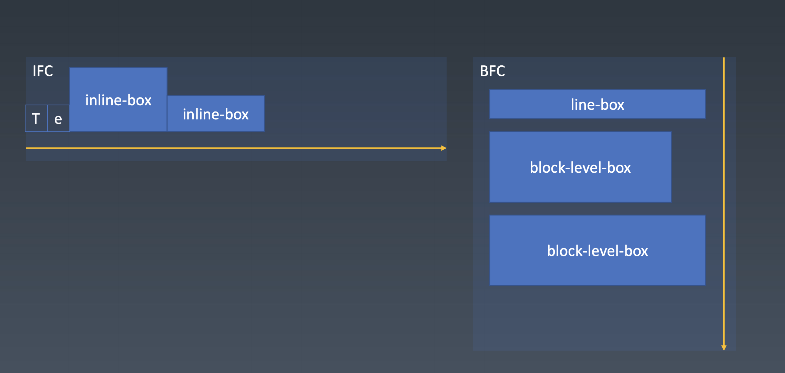
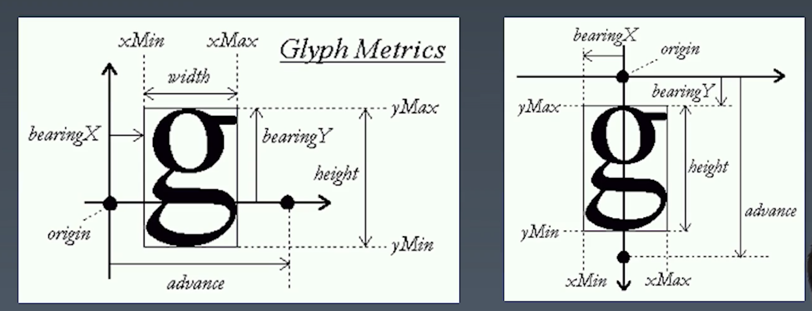
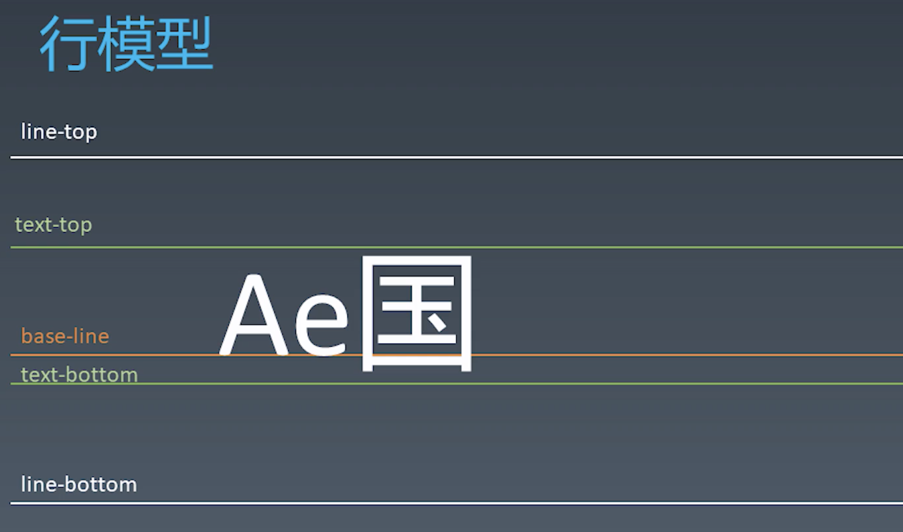
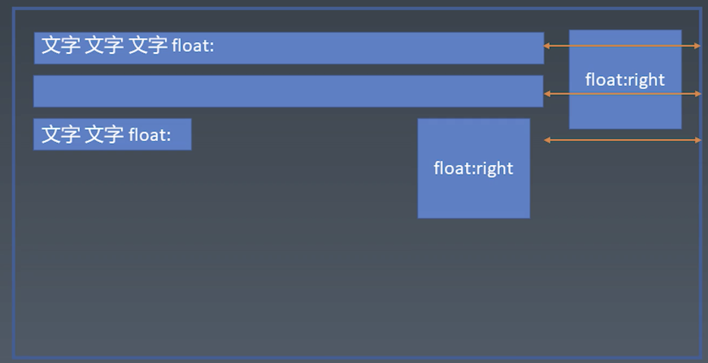

# 1、css排版｜盒

## 盒

HTML代码中可以书写开始`标签`，结束`标签` ，和自封闭`标签`。

一对起止`标签` ，表示一个`元素` 。

DOM树中存储的是`元素`和其它类型的节点（Node）。

CSS选择器选中的是`元素`。

CSS选择器选中的`元素`，在排版时可能产生多个`盒`。

排版和渲染的基本单位是`盒`。

## 盒模型
box-sizing
- content-box
- border-box

# 2、css排版｜正常流

## 三代排版技术
- 正常流排版
- 基于flex技术的排版
- 基于grid的排版
可能会有个3.5代，css Houdin带来的一种完全自由的，可以拿js干预的排版

## 正常流排版
- 收集盒（和文字）进行
- 计算盒（和文字）在行中的排布
- 计算行的排布

## 具体排布规则

当盒和文字在一个行里面的时候，它是从左向右排的，这意味着它的文字和盒有一个对齐规则。文字和inline-level-box，它们排出来的这种行，叫做行盒line-box。 单独占据一行的盒叫做块级盒block-level-box。整体来看，正常流就是一个一个的line-box和block-level-box从上到下的排布。如果没有block-level-box就都是行盒。每个行盒的内部是从左到右的排布方式。各起一个名字，排行内的叫IFC，排块级的叫BFC。其实BFC本来是一个非常简单的东西，它就是一个从上往下排布的上下文，IFC也就是一个从左往右排布的上下文，其实没有什么特殊的规则。

# 3、css排版｜正常流的行级分布

## Baseline
全世界各国的文字，其实都有一条基线对齐的规则，但是不同国家依赖的基线的位置不一样。中文是方块字，会以文字的上缘和下缘为基线去对齐，但这不妨碍我们也认为它是基于baseline对齐的，只是它带了一定的偏移。

## 文本的基本概念

任何文字都有一个宽和一个高，除此之外，他还有一个基线的定义。origin原点标示的位置就是文字的基线的位置。它是一基线的原点作为一个坐标，来定义文字的位置的。它有xMax和yMax，xMin和yMin。yMin的相反数就是基线到字的底缘的距离。bearingX决定了一个默认的字间距。advance就是字符整个占据的空间

## 行模型

文字的顶缘和底缘分别叫做text-top和text-bottom，只要字体大小不变，二者是不会变的。如果用了多种不同的字体混排，那么text-top和text-bottom是由fontSize最大的一个字体决定的。另外如果行高大于文字高度的，还会有line-top和line-bottom两条白色的线。

如果只有文字，行模型就是这样了。但是一旦涉及到跟盒的混排，就涉及到line-top和line-bottom的偏移问题。比如说如果我们的盒是从text-bottom去对齐的，当盒足够大的时候，它就有可能把高度撑开，这时候line-top就从虚线的位置移动到了白色实线的位置，这就是正常流中处理行模型的一个非常麻烦的现象。盒的先后顺序和盒的尺寸，都会影响line-top和line-bottom的位置，但是盒是不会影响text-top盒text-bottom的。

# 4、css排版｜正常流的块级分布
正常流还有两个非常复杂的机制，第一个就是float与clear的机制，行盒的宽度会根据float元素的宽度来进行调整，float的一个显著特征就是，它会影响行盒的尺寸。

float的元素也会受上一个元素的影响。

一个注意的点：margin collapse只会发生在BFC里面，不会发生在IFC或者其他的比如说flex，grid。只有正常流的BFC会发生边距折叠。

其实我们单看float，单看边距折叠，单看BFC，都不太难，但是如果三个现象叠加在一起，基本上就是我们的古代前端最大的难题。

# 5、css排版｜BFC合并

## Block
- Block Container：里面有BFC的
    - 能容纳正常流的盒，里面就有BFC，想想有哪些？

- Block-level Box: 外面有BFC的

- Block Box = Block Container + Block-level Box：里外都有BFC的

### Block Container
- block
- inline-block
- table-cell
- flex item
- grid cell
- table caption

### Block-level Box
大多数的display的值，它都有一对值，一个block level的，一个是inline level的。
- display: block; display: inline-block;
- display: flex; display: inline-flex;
- display: table; display: inline-table;
- display: grid; display: inline-grid;
- ...
display: run-in,根据自己的上一个元素来，有的时候是block level的，有的时候是inline level的。

### 设立BFC(四大类)
- floats
- absolutely positioned elements
- block containers（such as inlin-blocks，table-cells and table-captions） that are not block boxex
    - flex items
    - grid cell
    - ...
- block boxes with 'overflow' other than 'visiable'
非常不好记，但是其实我们换一个角度就好记了。默认这些能容纳正常流的盒，我们都认为它会创建BFC，但是只有一种情况例外，就是Block Box里外都是BFC，并且overflow是‘visible’。这个其实是非常合理的，里外都是BFC，而且overflow是visible，就相当于没有BFC。所以这个时候会发生BFC合并，BFC合并之后会发生什么呢

### BFC合并
- block box && overflow: visiable
    - BFC合并与float
    - BFC合并与边距折叠

因为BFC发生了合并，所以说里边的行盒跟这个float，就有了一定的影响，正常来讲我们放一个，我们这个如果是block box，它的overflow不是visible，它会创建独立BFC的话，那么它整个的block box放进BFC里，那么它的宽度，整个的block box受BFC影响，但如果它不创建BFC呢，那么它里面的行盒受float的影响，这是一个主要的区别
另外就是边距折叠，只会发生在同一个BFC里，如果创建了新的BFC的话，就不会发生边距折叠。没有创建BFC的话，它就存在着一个同向的边距折叠。

# 6、css排版｜Flex排版

## Flex排版
- 收集`盒`进行
- 计算盒在主轴方向的排布
- 计算盒在交叉轴方向的排布

## 分行
- 根据主轴尺寸，把元素分进行
- 若设置了no-wrap，则强行分配进第一行

## 计算主轴方向
- 找出所有flex元素
- 把主轴方向的剩余尺寸按比例分配给这些元素
- 若剩余空间为负数，所有flex元素为0，等比压缩剩余元素

## 计算交叉轴方向
- 根据每一行中最大元素尺寸计算行高
- 根据行高flex-align和item-align，确定元素具体位置

# 7、css动画与绘制｜动画
css所谓的控制表现，无非是有3类，第一类就是控制元素的位置和尺寸的信息的，第二类就是控制绘制和最后看到的实际的渲染的信息，第三类就是有一些交互与动画的信息。

## Animation
- 使用@keyframes去定义动画的关键帧
- 使用animation属性去使用关键帧的部分

## Animation
- animation-name: 时间曲线
- animation-duration: 动画的时长
- animation-timing-function: 动画的时间曲线
- animation-delay: 动画开始前的延迟
- animation-iteration-count: 动画的播放次数
- animation-direction: 动画的方向

## Animation
@keyframes mykf {
0% { top: 0; transition:top ease}
50% { top: 30px;transition:top ease-in } 75% { top: 10px;transition:top ease-out } 100% { top: 0; transition:top linear}
}
有一个常见的技巧是我们在这个里面去定义transition，而不是使用animation的timing-function，来让这个值发生改变，这样的话，它的每个两个关键帧之间，它的timing-function都可以不一样，不像animation一旦你这样指了，它的整个timing-function就确定了，就没有办法分段去指定了。

## Transition

- transition-property 要变换的属性;
- transition-duration 变换的时长;
- transition-timing-function 时间曲线; 
- transition-delay 延迟。

timing-function其实来自于一个三次贝塞尔曲线，所有的timing-function，都和三次贝塞尔曲线相关，https://cubic-bezier.com。贝塞尔曲线横轴表示的时间，纵轴表示的是进展。回弹可以超过对应的范围，它可以弹过终点再弹回来。有几个关键的三次贝塞尔曲线，就是我们内置的贝塞尔曲线，其中有ease，标准的缓动曲线，是一种最自然的曲线形态。linear是直线，它相当于退化为一个一次曲线，这个时候是没有必要去使用的。ease-in和ease-out分别表示一个缓动启动，一个缓动停止，ease-in往往用于退出动画，ease-out往往用于元素出现。