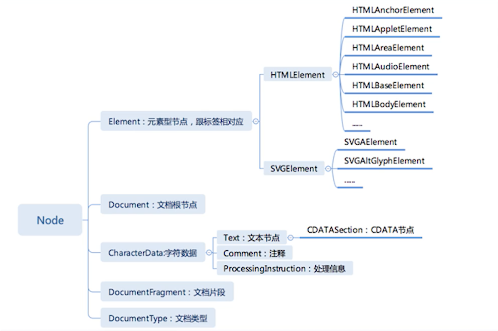

# 1、重学HTML｜HTML的定义：XML与SGML

HTML的主要源流来源于XML与SGML，这两个语言都在某种意义上讲是HTML的超集，但是发展到HTML5的以后的时代，HTML与它们的关系已经变得模糊了，HTML变成了一个接受XML和SGML的一定的灵感的一门独立的语言。

DTD是SGML规定的定义它子集的一种文档格式，HTML最早设计出来的是SGML的子集，所以它有DTD。XHTML1.0，对应的应该是HTML的4.2版本左右，所以说是HTML4的一个严格的模式。

- 从DTD了解HTML
https://www.w3.org/TR/xhtml1/DTD/xhtml1-strict.dtd

- 从namespace了解HTMLs
https://www.w3.org/1999/xhtml

# 2、重学HTML｜HTML标签语义

http://static001.geekbang.org/static/time/quote/World_Wide_Web-Wikipedia.html

strong表示这个词在整个文章中的重要性，em表示这个词在这个句子里面的重音是什么。

# 3、重学HTML｜HTML语法

## 合法元素
- Element: \<tagname>...\</tagname>
- Text: text
- Comment: \<!--comment-->
- DocumentType: <!DocType html>
- ProcessingInstruction: \<?a 1?>
- CDATA: \<![CDATA[ ]]>

## 字符引用
- (&#161;) \&quot;
- (&amp;) \&amp;
- (&lt;) \&lt;
- (&quot;) \&quot;

# 4、浏览器API｜DOM API

## 导航类操作
分为节点导航和元素导航
- parentNode 
- parent Element

- childNodes
- children

- firstChild
- firstElementChild

- lastChild
- lastElementChild

- nextSibling
- nextElementSibling

- previousSibling
- previousElementSibling

## 修改操作
- appendChild
- insertBefore
- removeChild
- replaceChild
其中appendChild和insertBefore是一组。为什么有insertBefore，而没有insertAfter，原因是最小化原则。加入有10个字节点，insertBefore可以插10个位置，appendChild可以插第11个位置。10个节点一共形成了11个空隙，所以这两个节点足够把节点插到任何一个位置。所以说insertAfter是可以用appendChild和insertBefore实现出来的，所以就没有这个API。

## 高级操作
-  `compareDocumentPosition`是一个用于比较两个节点中关系的函数。
- `contains`检查一个节点是否包含另一个节点的函数。
- `isEqualNode`检查两个节点是否完全相同
- `isSameNode`检查两个节点是否是同一个节点，实际上JavaScript中可以用“===”
- `cloneNode`复制一个节点，如果传入参数true，则会连同子元素做深拷贝。

# 5、浏览器API｜ 事件API
所谓事件的冒泡和捕获，跟监听是没有关系的，它在任何一次事件的触发过程中，两个过程都会发生。任何一个事件都有一个先捕获再冒泡的过程，为什么是先捕获呢？其实鼠标并不能提供我们到底点到哪个元素上这个信息，真正点在哪个元素上，我们是要通过浏览器把它计算出来的，所以一定有一个捕获过程，就是从外到内，一层一层地去计算，到底这个事件发生在哪个元素上，这个过程就是捕获。而冒泡则是我们已经算出来点到哪个元素，层层地向外去触发，然后让元素去响应这个事件的过程。所以说其实冒泡的过程更符合人类的直觉，我们在不传第三个参数的情况下，应该是一个冒泡的事件监听。

# 6、浏览器API｜ Range API

## 一个问题
- 把一个元素所有的子元素逆序

1 2 3 4 5 -> 5 4 3 2 1

# 7、浏览器API｜ CSSOM

# 8、浏览器API｜ CSSOM view

# 9、浏览器API｜ 其他API