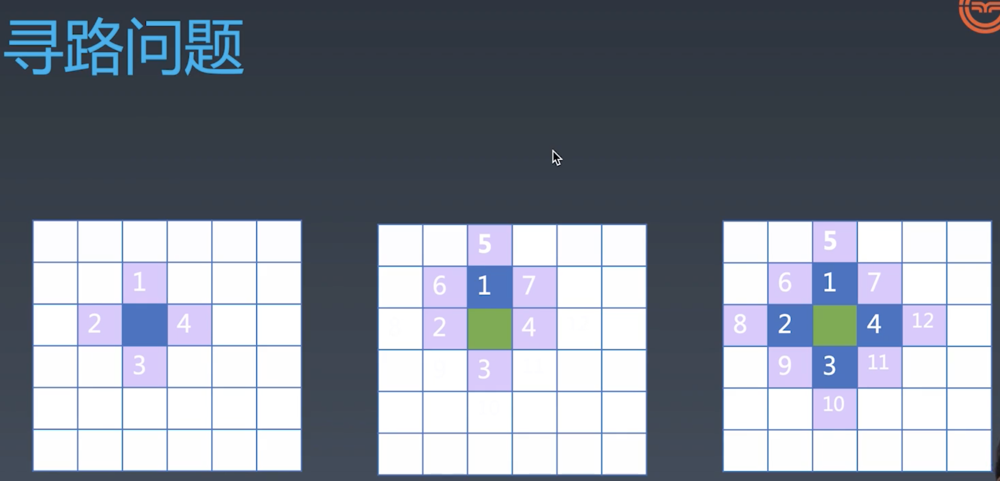

# 寻路算法

寻路算法是一个广度优先搜索办法，通过寻路可以熟悉广度优先搜索非常经典的算法。同时由于所有的搜索算法思路都非常相似，所以我们的寻路算法，我们在学习广度优先搜索的同时，也可以把其他的深度优先搜索之类的都讲完。而搜索是算法里特别重要而且通用性非常好的一类算法，所以可以在算法方面有一定的提升。另外寻路里有UI的部分，并且有一些JavaScript特有的跟语言特性结合的部分，我们通过这部分学习，也可以对JavaScript语言更熟悉。最主要我们可以综合运用上节课讲的异步编程的特性，介绍一些算法步骤的可视化相关的知识。通过把算法步骤的可视化，我们可以非常直观地看到算法的运转的状况，据此可以调试一些比较复杂的算法。

简化问题：

从起点能走到哪去->从起点第一步能走到哪去

- 从蓝色起点的格，能走到 1、2、3、4
- 从1，能走到5、6、7
- 从2，能走到8、9
- 从3，能走到10、11
- 从4，能走到12

再把5、6、7、8、9、10、11、12重复刚才的动作...，看它能够走到哪去，遇到边或者遇到障碍物，这个点就走不过去。所以寻路问题的解法，就是不断地把这个点周围的点，加进集合里，并且在集合里把它再次展开，把它周围的点再去加到集合里面。这个处理方法很容易想到递归，但这个处理方法并不适合用递归来表达。如果用递归就会是找到1以后，就去找1周围的点，也就是说567会在234前面被执行。如果用递归来表达，就会变成一个`深度优先搜索`，但是对寻路问题来说，深度优先搜索是不好的，`广度优先搜索`才是好的。

走过的点会加到一个集合，这个集合是所有搜索算法的灵魂。所有搜索算法的差异，其实完全就在queue这个集合里面。queue是一个数据结构，先进先出。JavaScript里的数组，就是一个天然的队列，它也是一个天然的栈。它有shift,unshift,pop,push。它的push如果和shift联合，它就是一个队列。它的pop和unshift联合，它也是一个队列。它的push和pop联合，它就是一个栈。shift和unshift同理。但我们一般不会用shift和unshift去做栈，因为考虑到JavaScript数组的实现，可能这样的性能会变低。

这里选择shift和push作为队列的出队和入队的方法。首先在队列里加入start，在第一遍循环的时候，我们就把start的4个周围的节点，加进队列里面，然后逐个把所有这个队列里的点，它周围的点全都加进这个队列，一直到这个队列变空为止，这就是广度优先搜索的主要的内容。

如果把queue改名叫stack，然后把push和shift，改成push和pop，它就变成了深度优先搜索。其实深度优先搜索和广度优先搜索，如果用代码来表达的话，它们就只差在这个数据结构上，到底是queue还是stack。A*搜索无非就是把queue变成了一个排序的接口。

完成了寻路的主体，但是它还有几个问题，第一个就是，算法虽然返回了true，看起来符合了我们的预期，但是它的正确性不太好保证。第二我们是要找到一条路径，而不是找到能不能走过去。

解决无法调试的问题->可视化
async await sleep

解决路径问题
在insert的时候，我们是知道它的前一个点是什么的。只要把map上标2的过程，改成标它的前驱节点的过程，就可以了。

## 启发式搜索
广搜式寻路并不是最好的寻路方案。启发式寻路就是我们用一个函数去判断，它的这些点扩展的优先级，我们只要判断好了优先级，就可以有目的地去寻路，比如说我们沿着点的方向，去优先地找寻路，但是找到的是不是最佳路径呢，数学家证明了，只要你这个启发式函数，它所使用的估值，只要能够一定小于这个点到终点的路径，那么它就是一个一定能找到最优路径的一种启发式寻路。这种能找到最优路径的启发式寻路，在我们的计算机领域里，叫做A*。而不一定能找到最终的启发式寻路的就叫A。所以A*是A寻路的一个特例。

只需要把queue变成一个能以一定优先级，来提供点的这样一个数据结构就可以了。这个排好序的数据结构能够保证我们每次take的时候，总是拿出来一个最小的，give的时候，那我们不管。Sorted这种有序的数据结构有很多种实现，可以用数组，winner tree，heap堆，二叉树，排序二叉树等。 