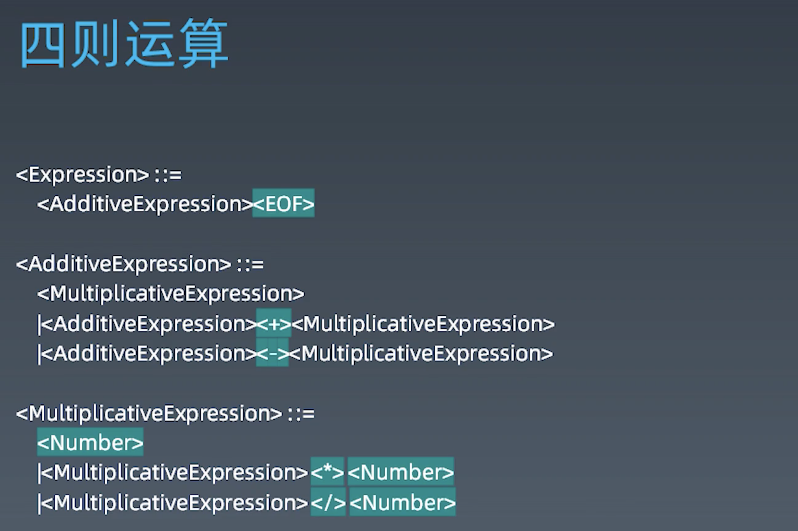
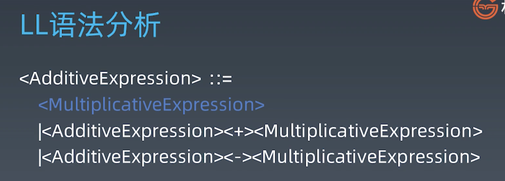
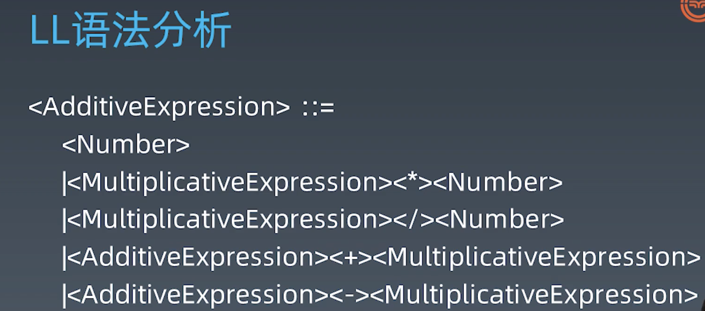

# 使用LL构建AST
AST叫做抽象语法树。我们的代码，在计算机的分析过程中，首先就是把我们的编程语言`分词`，然后分词之后的下一步，就是把这些词，让它构成这种层层相嵌套的这种语法树的树形结构，然后下一步才是如何解析我们的代码去执行。
构建AST语法树的过程又被叫做`语法分析`，最著名的语法分析算法，核心的思想有两种，一种是LL算法，一种是LR算法，LL算法就是从左到右扫描，从左到右规约这样的一个缩写。
## 一、四则运算
- TokenNumber：1 2 3 4 5 6 7 8 9 0的组合
- Operator：+ - * / 之一
- Whitespace：\<sp>
- LineTerminator：\<LF>\<CR>
我们认为加法是由左右两个乘法组成的，并且加法是可以进行连加的

绿色部分为终结符

## 二、正则表达式
## 三、LL词法分析
## 四、LL语法分析
LL语法分析的基本结构就是每一个产生式，对应着一个我们的函数

