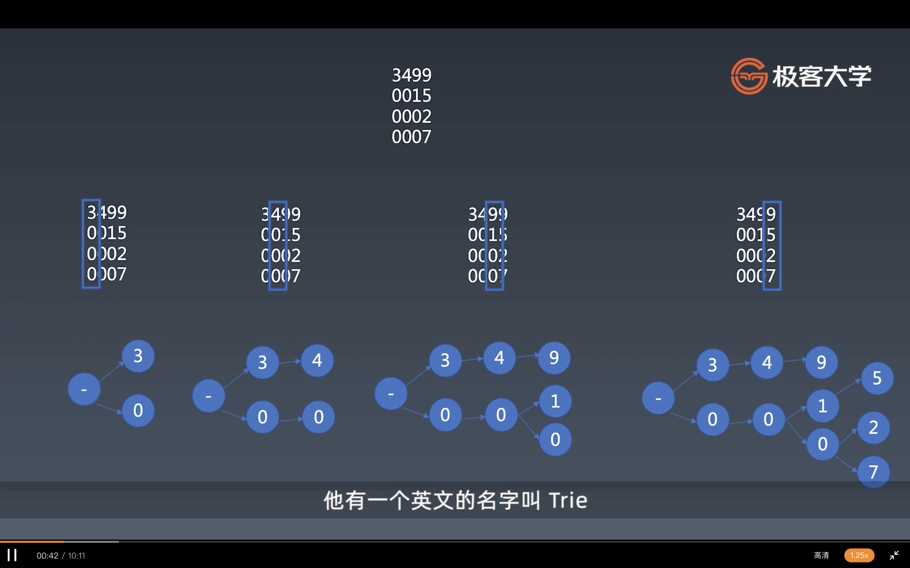

# 字符串分析算法

## 一 总论

- 字典树（完全匹配）
    - 大量高重复字符串的存储与分析
- KMP（部分匹配）
    - 在长字符串里找模式
- Wildcard
    - 带通配符的字符串模式
- 正则
    - 字符串通用模式匹配
- 状态机
    - 通用的字符串分析
- LL LR
    - 字符串多层结构分析

最简单的是字典树，它是用来精确地匹配字符串和模式的，用来处理大量高重复字符串的存储与分析。比如说我们要处理一亿个字符串，这里边有多少出现前50的。有时候做搜索关键词，很多时候我们都会用到类似字典树这样的一个结构。

KMP不是完整字符串匹配的算法，它是检查一个长字符串里有没有一个短字符串的部分，它是一个部分匹配。它跟字典树最大的区别是字典树是检查两个字符串是否完全匹配，KMP是一个字符串是另一个字符串的部分。如果我们去想一个长度m的字符串和一个长度为n的字符串，他俩互相匹配，如果我们用一个最笨的办法，它可能是一个m*n的时间复杂度。但是KMP（K是高德纳，共同发明了KMP算法），就是在一个长字符串里，匹配一个短字符串，它的复杂度可以做到m+n。

Wildcard在KMP的基础上加了通配符，问号和星号，问号表示匹配任意字符，星号表示匹配任意数量的任意字符。我们在做一些文件查找的时候，可能就会用到Wildcard这种通配符的形式，可以理解为它是一个弱一点的正则，因为它只有两种通配符。而这个通配符，和正则有一个显著的区别，就是Wildcard也是可以在O(n)的时间复杂度内被处理掉的，或者是O(m+n)这样一个规模去处理掉的，这个是有一个贪心算法。

正则一般来说是需要用到回溯的这样一个系统，它可以说是字符串模式匹配的一个终极版本。

状态机应该是一个比正则更强大，正则跟有限状态机理论上是完全等价的两种东西，但是有限状态机不同的是，还可以往里嵌代码，可以对字符串做额外处理，但区别是正则写起来很方便，有限状态机的成本比较高，还需要一定的设计。在简单的匹配和分析的基础上，如果说，要对字符串建立起来多层级的结构，我们就会使用LL和LR这样语法分析的算法。LR是一个比LL更强大的语法分析，但通常简单写就都用LL去写，因为LR的理论性比较强。前面讲过HTML的算法使用一个stack处理，他其实就是LR算法的一个简化版，他其实是LR(0)，但是一般来说，我们去处理都会用LR(1)，LR(1)是可以等于到LL(n)的非常强大的分析算法。

- 字典树

我们会用一个对象来作为字典树的节点，当然用Map也是可以的。在JavaScript里最合适用作保存字典树里面的分支的数据结构就是Object或者Map，因为字典树里只会存字符串，所以对象和map没有本质区别。

- KMP
KMP是一个字符串的模式匹配算法，所谓模式匹配，其实就是我们查一个字符串里，有没有另一个字符串，他有一个原串，就是我们待查的串，有一个比较短的叫做pattern串。如果我们先不考虑KMP算法，如果我们用一个最朴素的算法，比如说叫Brute-Force（BF),暴力解，就是我们从长的字符串的每一个节点开始，每个位置开始，然后去匹配，看有没有能够匹配到pattern的串，这个算法它的时间复杂度是m*n。但是有三位科学家发明了KMP算法，K就是高德纳（Donald Ervin Knuth），计算机程序艺术的作者。

pattern：abcdabce
source: abcdabcdabcex

- wildcard
*是要尽量匹配的多还是尽量匹配的少呢？
最后一个\*号和前面的\*号是不一样的，因为最后一个*号可以尽可能地匹配多的字符，而不管前面剩了多少字符，它其实都可以匹配到。而前面的\*，都是尽量地少匹配，