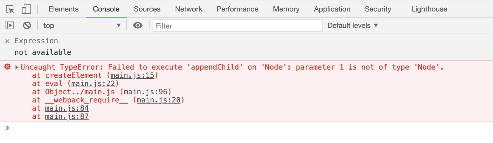

# 1.组件化的基本知识｜组件的基本概念和基本组成部分

前端架构里最热门的两个话题，一个叫做组件化，另一个叫做架构模式。
组件化就是一个最基本的，我们怎样去扩展html标签，从这个开始引申出来的一个前端架构体系。它的主要的目标就是`复用`。
架构模式就是大家特别熟悉的，MVC，MVVM，它主要关心的就是前端跟数据逻辑层之间是如何去交互的。


前端架构里，组件化的部分可以说是重中之重，同时在工程的实际操作里面，组件化比MVC这样的架构模式，要更重要一些。因为组件化基本上直接决定了一个前端团队的复用率。一个好的组件化体系，它能够帮助一个前端团队，提升它的复用率，并且写代码的时候，能够少很多的心智负担。

## 对象与组件

### 组件的基本概念

我们一般说组件，它会区别于模块，区别于对象。为什么我们不说模块化，模块化其实也是我们架构里非常通用的概念，对象其实也是架构里非常重要的一个概念。一般来说，我们认为组件，它是跟UI强相关的一种东西，某种意义上可以认为它是一种特殊的模块，或者是特殊的对象，注意它既是对象又是模块，它的特点就是它可以以树形结构来进行组合，并且它有一定的这种模版化的配置的能力，这就是组件的一个基本概念。

### 对象与组件的区别
对象我们一般来说，它有三大要素，属性、方法、继承关系。基本上可以通过这三者，去描述一个对象。
#### 对象
- Properties
- Methods
- Inherit

组件包含的语义要素，要更丰富一些，它除了Properties，还有Attribute，这两个东西在英文里还是有一个蛮大的区别的，但在中文里，通常都会翻译成属性。在同时出现两者的场景，有时候我们会把Attribute翻译成特性，把Properties翻译成属性。
另外组件它是有config的，config就是对组件的一种配置。一般来说，config就是我们在创建一个对象时，在构造函数里传个参数。同时它又有state，state就是随着人的操作，或者是一些方法的调用，组件state会发生一些变化，这个就是组件的状态。它跟config会有相似的地方，可能甚至是相通的，它跟property和attribute也有可能是相似的或者相通的。
再有一个就是event，event就是组件往外去传递东西。
然后就是组件会有一个生命周期。
最后就是非常重要的，组件的children，其实children不是children，它是树形结构的一个必要性。这是一个必要条件，如果没有children，形不成树形结构，描述界面的能力就会差很多。
组件在对象的基础上，加了这么多语义相关的概念，使得组件变成一种非常适合描述UI的的一个概念。

#### 组件
- Properties
- Methods
- Inherit
- Attribute
- Config & State
- Event
- Lifecycle
- Children


End User，也就是非程序员的用户，会对组件去做一些操作，这些操作会影响组件的state，而state有时候会进一步影响组件的子组件children。

程序员会通过Attribute更改组件的一些特征或者特性，Attribute和property主要的区别，Attribute往往是用这种markup language，这是一种声明型的语言，也不一定是我们的html这种类xml的语言。

component user，也就是使用组件的程序员，他除了通过markup去影响组件，还可以通过property去影响组件。attribute和property是一回事吗，有些时候是，有些时候不是，这完全取决于组件体系的设计者。如果是组件体系的设计者或者是组件的实现者，是有决定权的，是否让attribute和property统一。甚至有一些比较激进的方案，把state，config，attribute，property四者全都统一，也是可以的。

Method跟property其实差不多，只不过method它可能用于描述复杂一点的过程。但是JavaScript里的property，它是允许有getter和setter的，所以说最终两者的作用其实是差不多的。
如果说method和property是使用组件的程序员向开发组件的程序员传递消息，那么Event就是反过来了，它是由开发组件的程序员，向组件的使用者，去传递信息。


attribute强调描述性，property强调一种从属关系，如果说一个对象的property是另一个对象，那么大概率这两个对象是存在一个从属关系的，就是子对象从属于父对象。这两个词在英文上有这样一个区别，那么在实际使用上，往往property是我们用面向对象的里面的一个property，而attribute，它最初的使用，就是我们的xml的attribute的这样的一个概念，它们两个有些时候是比较相似的，有些时候又是不同的。


html就是一个典型的property和attribute两者不等效的一个系统，html里的attribute是可以通过html代码去设置的，当然了，html的attribute也是可以通过JavaScript去设置的。
```
myComponent.setAttribute(a, value) // attribute
myComponent.a = value // property
```
它们两个并不只是两种写法，它们的行为其实是有区别的


第一个例子，名字不一样。因为早年的JavaScript里，class是关键字，早期的JavaScript里，是不允许关键字做属性名的，现在改过来了，关键字可以做属性名。但是为了规避这一问题，html里做了一个妥协的设计，它把attribute仍然叫做class，但是property叫做className，两者之间是完全的互相反射关系。


attribute是一个字符串，property是字符串语义化之后的对象。最典型的就是`style`，style属性在html里，attribute style，是一个字符串，如果用getAttribute和setAttribute也可以去设置attribute。但是如果用style属性，你就可以得到一个key value的结构。因为key value结构语义化更好用，能得到div的style，一般都主要用property。


然后就是`href`。href属性，它attribute和property属性的意思差不多，但是property是一个经过resolve的URL，比如这里写//taobao.com，它这个http和https协议是根据当前页面做的，resolve过的就是property，没resolve过的，html里写啥是啥的是attribute。

这个时候我们可以看到了，在代码里是同时可以访问到attribute和property的，它俩的语义虽然非常接近，但是它不是一回事，它俩也会互相更改。


最神奇的就是input的value。这个value特别的坑。很多同学都觉得value是两者完全等效的东西，其实不是。attribute相当于是value的一个默认值，就是说无论是由用户在input里去修改，还是由程序代码里给property赋值，它的attribute是不会跟着变的。然后它的显示上，是会优先显示property的。用jQuery时，总觉得prop和attr这两个好像差不多，没想到value就经常踩坑。所以后来jQuery除了一个叫val的方法，干脆就别去想是attribute还是property了，我提供一个val你去用。

html作为一个非常著名的有非常顶级的专家设计的这样一个标签系统，它的attribute和property，两者是不等效的。如果让你设计一个标签系统，你会把它设计成等效的还是不等效的呢。

#### 如何设计组件状态

分成四个场景
- 用标签去设置
- 用JavaScript去设置
- 用JavaScript去改变
- 由终端用户的输入去改变
property是不能用markup这种静态的声明语言去设置的，它可以被js设置，也可以被js去改变，大部分情况下，property是不应该由用户输入去改变的，少数情况下，它可能来自于你的业务逻辑，那么它有可能会接受用户输入的改变。
attribute是由markup去设置，js去设置，js去改变，都是可以的，用户的输入不一定会改变它。
state有一个很大的特点，它只能从组件的内部去改变，它不会从组件的外部去改变。比如用组件的人想要从外部去改组件的state，一般来说写组件的人不会提供这种能力，因为这样的话state就失控了，无法保证state的一致性。但是用户的输入是可以改变state的。
config是一个一次性的结果，它只有在组件构造的时候会触发，它能够一次性地被传进来，它是不可更改的。由于config这种不可更改性，我们通常会把config留给全局。

#### 组件的生命周期

最先想到的是`created`和`destroyed`。
创建了之后，有没有被显示出来，放在屏幕的树上（`mount`）。而mount和`unmount`它们两个是会反复发生的，unmount之后是可以回到created的状态。
一个组件还有什么时候会改变自己的状态呢？有两个。一个是组件的使用者，它能够通过代码去更改组件。第二个是组件的终端用户的操作。这两个可以统一到一起，叫做组件更新（`render/update`）。又会触发一个生命周期。
这些生命周期加在一起，基本上就是一个组件整个的生命周期。而看到的一些willMount和didMount，其实无非都是这些生命周期里的一些更细节的位置。

#### children

children是构建组件树最重要的一个组件的特性，一种我们管他叫content型的children，就是我有几个children，最终就显示出来几个children。还有一种叫做template类型的children，这个时候children充当了一个模版的作用，比如说我们设计一个list，它可能有list这样一个结构，但是它的children，并不能够反映它实际最后显示出来的组件的数目。因为我们的list一般来说要接收一个data，它就是由这个数据来产生的，我有一个100项的数据，那么它就有100个实际的children，这个模版会被复制100份，这就是所谓的template类型的children。所以我们在设计组件树的children的时候，一定要考虑到这两种不同的场景，比如说react，虽然它没有template类型的children，但是它的children可以传函数，传函数可以return一个children，这个时候它就充当了一个模版型的children的作用。

## 从零开始建立一个组件系统
关于一个组件系统，它首先是一个由markup和JavaScript代码两者都可以访问的一个环境。所以第一步就需要建立一个能够使用markup的环境。这里会展示两种markup的建立的风格。第一种是基于跟react一样的jsx去建立我们组件的风格。第二种则是我们去基于类似vue这种，标记语言的parser去建立组件的风格。

# 2.组件化的基本知识｜为组件添加jsx语法

## jsx 
jsx一般在大家的认知里，它是属于react的一个部分，但是react在早期，尤其是Facebook在早期，会把jsx定义成一种纯粹的语言扩展，它也是可以被其他的组件体系去使用的，甚至我们可以单纯地把它作为一种创建html的标签的快捷方式去使用。

搭建jsx环境
- 1. 全局安装webpack和webpack-cli
- 2. 安装babel的loader(babel的loader其实并没有直接依赖好babel)
配置webpack的entry：
```
module.exports = {
    entry: './main.js'
}
```
打包：将一个main.js打包，末尾有main.js里的for of代码
- 3. 安装babel(@babel/core @babel/preset-env)
配置webpack的babel-loader的`presets`：
```
    module: {
        rules: [
            {
                test: /\.js$/,
                use: {
                    loader: 'babel-loader',
                    options: {
                        presets: ['@babel/preset-env']
                    }
                }
            }
        ]
    }
```
打包：原来写的for of被重新编译了，编译成了一个普通的for循环，这个就是babel的preset-env的转换效果了。
```
    mode: 'development'
```
打包：代码不再压缩了，代码被放到了eval()里，这样我们在调试的时候就可以把它作为一个单独的文件去使用了。
但这时候在代码里直接使用jsx会报错，提示不允许使用小于号。
- 4. 安装babel的plugin
配置webpack babel-loader的`plugin`
```
    module: {
        rules: [
            {
                test: /\.js$/,
                use: {
                    loader: 'babel-loader',
                    options: {
                        presets: ['@babel/preset-env'],
                        plugins: ['@babel/plugin-transform-react-jsx']
                    }
                }
            }
        ]
    }
```
打包：eval里jsx被翻译成了React.createElement的函数调用。

# 3.组件化的基本知识｜jsx的基本使用方法
@babel-plugin-transform-react-jsx允许加prama配置，来更改函数的名字
```
plugin-transform-react-jsx', {pragma: 'createElement'}]]
```
比如设置pragma为createElement，打包结果里Rreact.createElement就变成了createElement。这样一改，我们的jsx就跟react没有任何联系了。但这时候新建main.html去引用main.js会报错createElement is not defined，事实上我们也并没有定义这个函数。
```
function createElement () {
    return
}
```
写一个createElement让它直接返回，不再报错，在开发者工具里查看打包后的代码。


createElement接收了两个参数，第一个是div，第二是null，第二个参数位其实是传属性列表的，这里div没有任何attribute，所以这里是null。
```
let a = <div id="a"/>
```

加属性后，第二个参数变成了一个JavaScript对象，它是一个key-value的形式。

所以，其实jsx没什么神秘的，它就是把我们平时写的函数调用，用了一个看起来比较像html的形式给改写了一下，我们可以认为这个属于一种语法糖。但是这个语法糖它影响了语法的结构，所以我们一般也不会把它完全叫做语法糖。
接下来试着写一个更复杂一点的jsx，让它有一些children。
```
let a = <div id="a">
        <span></span>
        <span></span>
        <span></span>
    </div>
```

可以看到三个子元素span递归地地用了createElement，它其实是形成了一个树形结构，父级createElement，所有的子元素被作为后面的参数传了进去。 这样createElement返回了什么的话，它就会作为它的第三个参数开始传进去。
到此就可以给createElement写出一个参数列表了
```
function createElement (type, attributes, ...children)
```

```
function createElement (type, attributes, ...children) {
    let element = document.createElement(type)
    // element是个对象，用for in遍历它的属性
    for (let name in attributes) {
         element.setAttribute(name, attributes[name])
    }
    // children是一个数组，用for of遍历
    for (let child of children) {
        element.appendChild(child)
    }
    // 最后返回dom节点
    return element
}

let a = <div id="a">
        <span></span>
        <span></span>
        <span></span>
    </div>

// 要保证html里有body标签
document.body.appendChild(a)
```

接下来还剩一个问题，就是文本节点。把子元素替换成文本节点
```

let a = <div id="a">
        hello world ！
    </div>
```

可以看到build出来children部分是一个字符串，它不会再调用createElemnt

```
    for (let child of children) {
        if (type === 'string') {
            child = document.createTextNode(child)
        }
        element.appendChild(child)
    }
```
这时候element.appendChild就可以执行了。hello word也正确显示了。

到现在为止，createElement已经是一个比较有用的东西了，它可以完全代替document.createElement这种比较繁琐的操作了。 
把之前的span加回来并添加abc文本节点
```
let a = <div id="a">
        <span>a</span>
        <span>b</span>
        <span>c</span>
    </div>
```

# 轮播组件
用transition来控制动画的时间。一般来说，播一帧会用一个0.5s的ease。transition一般来说，都会只用ease，除非是一些非常特殊的情况，退出动画我们可能会采取ease-in，进入动画我们可能会采取ease-out。linear在大部分情况下是不用的。ease是符合人类感受的一种运动曲线。transition我们可能会用js去去覆盖它，当我们需要做一些不需要transition的调整的时候，我们用js去覆盖它。如果没用js去控制它，有transition的效果就可以用css去控制，这是一个比较好的实践。
我们想让它轮播，实际上移动的是child的为止，我们让它每隔3s移一次，给children加一个transform。
```
for (let child of children) {
    child.style.transform = `translateX(-${current * 100}%)`
}
```
现在还有个问题，就是它播完了就跑了，我们希望它播完了还回到第一张。这时候我们让它第一张播完了之后，最后让它回来。所以我们希望current不要每次都播到最大，所以我们用了一个数学上的技巧，如果我们想让它在1到n之间循环，那么我们让它对n取余就可以了。这个时候children的长度是4，current就永远都不会超过4。
```
current = current % children.length
```
这个时候轮播效果就出现了。但是又有一个问题，它并没有产生一个一直往前播的感觉，而是在最后一下回到了第一张。通过观察发现可视区域内其实最多有两张图片，那么我把这两张图片给它挪到正确的位置就可以了。这两张图片分别是当前这张和下一张。分别通过currentIndex和nextIndex来表示这两张图片的索引。
```
nextIndex = （currentIndex + 1） % children.length

let current = children[currentIndex]
let next = children[nextIndex]
```
然后把current和next移到正确的位置。current的位置一定是正确的，next的位置，是当前的位置加上100%。这里就有问题了，当前的位置，需要加上它原有的位置，因为next的元素本来就有一个偏移，next它的偏移就是nextIndex。这个挪动是不希望有动画的，所以通过js覆盖transition。挪动之后再去掉覆盖。
再把current的transform改成-100，next的改成0。
```
next.style.transition = 'none' 
next.style.transform = `translateX(${100 - nextIndex * 100}%)`

next.style.transition = '' 
current.style.transform = `translateX(${-100 - currentIndex * 100}%)`
next.style.transform = `translateX(${-nextIndex * 100}%)`
```
但这样直接写是不对的，next的两个值会被覆盖，所以需要加一个setTimeout。这个setTimeout可以是一个非常短的时间，这里用16毫秒就可以了。16毫秒正好是浏览器里一帧的时间。不能用requestAnimationFrame，或者说requestAnimationFrame这里有一个比较复杂的逻辑，如果用的话，需要用两次requestAnimationFrame。
```
next.style.transition = 'none' 
next.style.transform = `translateX(${100 - nextIndex * 100}%)`

setTimeout(() => {
    next.style.transition = '' 
    current.style.transform = `translateX(${-100 - currentIndex * 100}%)`
    next.style.transform = `translateX(${-nextIndex * 100}%
    currentIndex = nextIndex
}, 16); 
```

## 拖动切换
分别检查mousedown，mousemove，mousedown事件。我们拖拽的时候，其实是希望mousedown以后再去响应mousemove，然后mouseup以后就不再响应mousemove了。所以我们监听事件的时候，应该把mousemove和mouseup都放在mousedown里面去监听，并且我们应该在mouseup的时候，把mousemove和mouseup这两个事件停掉，所以需要用两个单独的函数给它们起个名字。经过这种代码设置，它会触发一个mousedown，然后触发一系列mousemove，最后触发一个mouseup，永远是这三个事件一组。还要考虑到一个问题，mousedown是在root元素上监听，move和up就没有必要在这个上面监听了，而是在document上直接监听。在现代浏览器里，在document上监听还会有额外的好处，document可以让我们即使是移出了浏览器的范围外，它也能监听到这个事件触发它们。这样是我们比较好的一个实践。
```
this.root.addEventListener('mousedown', event => {
    console.log('mousedown')
    let move = event => {
        console.log('mousemove')
    }
    let up = event => {
        console.log('mouseup')
        document.removeEventListener('mousemove', move)
        document.removeEventListener('mouseup', up)
    }
    document.addEventListener('mousemove', move)
    document.addEventListener('mouseup', up)
}
```

首先写move里面的逻辑，event上有很多个鼠标的所谓的坐标，都是根据不同的参考系来的。比较推荐使用的是clientX和clientY，它表示相对于整个浏览器的可渲染区域的坐标，这个坐标胜在不受任何因素影响。比如说整个的组件在一个滚动的容器里，容器滚了之后很有可能坐标就变了，甚至会因一些定时任务而滚，这样就会出现一些不可调和的bug。那clientX和clientY就不会出这种问题，你拖动多远它就是多远。
```
let move = event => {
    let x = event.clientX - startX
    for (let child of children) {
        child.style.transition = 'none'
        child.style.transform = `translateX(${x}px)`
    }
}
```
这时候可以有一个拖起来挪动的效果。但是问题是松手的时候，没有回到某一帧，所以需要在mouseup的时候在做一个处理。另外每次捡起来的时候位置也不对，只有第一次捡起来的时候位置是对的。
设置一个position，捡起来的时候是-position*500+x。因为挪到第二张的时候，就是从第二张开始的translate了。
```
let move = event => {
    let x = event.clientX - startX
    for (let child of children) {
        child.style.transition = 'none'
        child.style.transform = `translateX(${-position * 500 + x}px)`
    }
}
```
up的时候，设置child位置，如果拖够了一半就会变成一个新的位置，如果拖不够一半，经过round就是0。
```
let up = event => {
    let x = event.clientX - startX
    position = position - Math.round(x / 500)
    for (let child of children) {
        child.style.transition = ''
        child.style.transform = `translateX(${-position * 500}px)`
    }
    document.removeEventListener('mousemove', move)
    document.removeEventListener('mouseup', up)
}
```
这时候可以一张一张拖动了，只是没有设置截至条件或者循环条件。

目前代码里是移动了所有的children，但是屏幕上一共有两个children就足够了，同一时刻最多能显示两个children，这是一个可优化的点。
接下来看如何实现循环。其实循环在自动播放部分已经使用过了，但是我们使用鼠标去挪的时候，情况比较复杂一些。因为自动播放只有一个方向，一定是从前往后播。
更改仍然从move函数开始，首先算出来当前在屏幕上的中心元素，它的位置是`let current = position - Math.round(x / 500)`，但是它可能是前边露一个边，后边露一个边，干脆也不算前边还是后边，有些麻烦。直接用一个for循环，把-1和1都给加上，
这样就是当前中心元素的前一个和后一个，我们都把它移动到正确的位置去。计算每个元素的pos，`let pos = current + offset`，但是current + offset是有负数的，我们不希望它变成负数，所以我们要用一个手法，一共有4个元素，怎么让-1变成3，-2变成2，-3变成1呢，这个单纯地用取余运算是做不到的，它会发生一个变成负数的一个现象，就是-1取余会变成-1。这里我们用一个小技巧，把它加上要取余的length，`pos = (pos + children.length) % children.length`，这样-1就会变成3了。这是用取余运算来处理循环的一个小技巧。
```
let move = event => {
    let x = event.clientX - startX
    let current = position - Math.round(x / 500)
    for (let offset of [-1, 0, 1]) {
        let pos = current + offset
        pos = (pos + children.length) % children.length // 利用取余运算处理循环的小技巧
        children[pos].style.transition = 'none'
        children[pos].style.transform = `translateX(${- pos * 500 + offset * 500 + x % 500}px)`
    }
}
```
这时候有一个跳变，是不对的，问题出在current的Math.round逻辑，因为他最后加上了`x % 500`的值，所以这里应该是x减掉x % 500，然后在除以500，`let current = position - ((x - x % 500) / 500)`，它起到了一个整数的效果。 他能保留x的符号，并且它一定是绝对值更小的那个。

```
let move = event => {
    let x = event.clientX - startX
    let current = position - ((x - x % 500) / 500)
                
    for (let offset of [-1, 0, 1]) {
        let pos = current + offset
        pos = (pos + children.length) % children.length // 利用取余运算处理循环的小技巧
        children[pos].style.transition = 'none'
        children[pos].style.transform = `translateX(${- pos * 500 + offset * 500 + x500}px)`
    }
}
```
到这里还没有改up的逻辑，但是move已经完全正确了。它的逻辑和move是比较相似的。
```
let up = event => {
    let x = event.clientX - startX
    position = position - Math.round(x / 500)
    for (let offset of [-1, 0, 1]) {
        let pos = position + offset
        pos = (pos + children.length) % children.length // 利用取余运算处理循环的小技巧
        children[pos].style.transition = ''
        children[pos].style.transform = `translateX(${- pos * 500 + offset * 500}px)`
    }
    document.removeEventListener('mousemove', move)
    document.removeEventListener('mouseup', up)
}
```
这个逻辑是对的，但因为z-index的关系，经常会有一个飞过去，但飞过去的元素肯定是我们不需要的元素，所以我们只需要在-1和1之间，把不需要的元素去掉即可。for of其实并没有一定的顺序要求，所以我们在这里把它变成-1或者1里面那个需要的就可以了。
`Math.round(x / 500) - x`就是滚动的方向，然后通过取符号变成-1或者1。`-Math.sign(Math.round(x / 500) - x)`
```
let up = event => {
    let x = event.clientX - startX
    position = position - Math.round(x / 500)
    for (let offset of [0, - Math.sign(Math.round(x / 500) - x)]) {
        let pos = position + offset
        pos = (pos + children.length) % children.length // 利用取余运算处理循环的小技巧
        children[pos].style.transition = ''
        children[pos].style.transform = `translateX(${- pos * 500 + offset * 500}px)`
    }
    document.removeEventListener('mousemove', move)
    document.removeEventListener('mouseup', up)
}
```
这时候飞来飞去的问题消失了，但是如果拖的过短，没有过一张图的时候，这里算的是错误的，原因是这里的Math.round，没超过250和超过250是朝两个方向round的。所以修复这个问题的时候给它加上(250 * Math.sign(x))
```
let up = event => {
    let x = event.clientX - startX
    position = position - Math.round(x / 500)
    for (let offset of [0, - Math.sign(Math.round(x / 500) - x + 250 * Math.sign(x))]) {
        let pos = position + offset
        pos = (pos + children.length) % children.length // 利用取余运算处理循环的小技巧
        children[pos].style.transition = ''
        children[pos].style.transform = `translateX(${- pos * 500 + offset * 500}px)`
    }
    document.removeEventListener('mousemove', move)
    document.removeEventListener('mouseup', up)
}
```