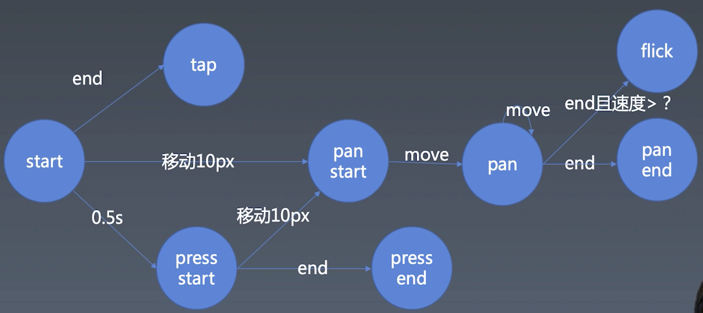
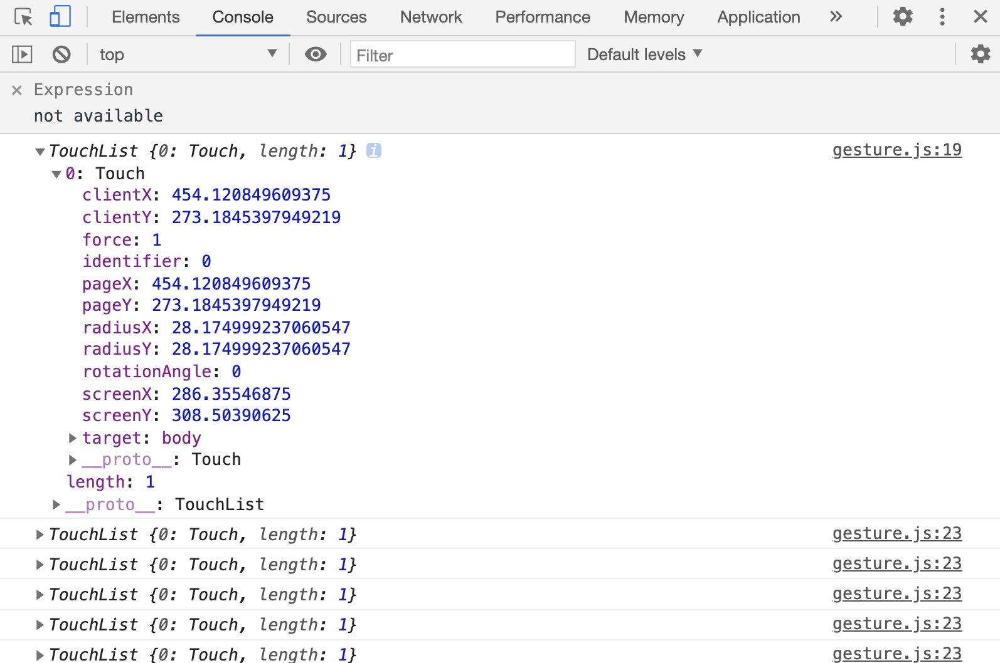

# 手势与动画

gesture
无意间的拖拽也会产生一定的位移，这其实并不是我们所提倡的一种行为。另外还有一个致命的问题，当我们去点击的时候，当我们去点击的时候，鼠标可能会好一点，它比较稳定，但是触屏就不一样了，它难免发生一些微小的位移。当你点击和位移的时候，它的事件的发生序列，都会是一个down，move，up的一个过程，触屏上可能就是touchstart，touchmove，touchend。

## 1. 手势的基本知识

- start是会发生的第一个事件，start发生了之后，接下来如果我们直接end，就发生了一个tap，没有任何其他操作，这时候我们就认为发生了一次点击事件，在手势里称做tap，它跟click是比较相似的一个事件。

- 如果我们没有把手抬起来，发生了一个移动的事件，一般来说我们在识别上，会允许一个较低的误差，我们会用10px来作为误差的容错范围，这个10px一般是特指我们在Retina屏幕上的一个10px，如果是一倍屏要改成5px，如果是三倍屏的话，要改成15px。超过10px这个事件叫做pan，pan它是一个摄影里面的术语，表示移动摄像机的意思，这里我们表示一个比较缓慢的触点的推移，移动10px会变成pan start，之后每一次move都会触发pan事件，也有的叫做pan move，因为pan的事件是一个持续性事件，它是有一个start，move，end的过程。然后这里面存在一条分支，如果我们在end的时候达到了一定的速度，我们就会认为它是一次清扫事件，叫做flick，还有一个常见的名字叫做swipe，这两个词基本上在手势里面是等义的。

- 还有一种行为是当你去按着的时候，有一个长按的事件，这个长按我们一般有一个0.5s的判定，如果按住一个点，超过了半秒，我们认为你是按压而不是轻点，手机上按压可能会弹出一个菜单，多数的press，它监听的都是press start事件，press它可能还有一个end，但是end之前，如果press发生了10px的位移，它同样要进入pan的状态。这个分支是我们在设计手势库的时候经常会遗漏的一条线，然后press start了之后，如果我们没有移动，经过一段时间之后手再松开，那么就会发生press end事件，我们也有一些操作是在press end的时候触发的。
这就是我们基础手势的一个体系，但是没有包含双指手势。

## 2. 实现鼠标操作
mouse事件是不能够被转化成触屏事件的，但是click这类更高级一点的事件是，它是可以监听到的。如果把浏览器切到移动模式，会发现移动端的触屏事件是不会触发mouse系列事件的。我们要使用touchstart，touch系列的事件，跟mouse系列的事件不一样，首先touch事件触发了以后，move一定是跟touch触发在同一个元素上的，不管手的位置移动到哪里，所以不需要向mouse系列事件一样，在mousedown之后才去监听mousemove。touch系列的事件监听都是并列的。看起来touchstart，touchmove，touchend和mousestart，mousemove，mouseup是一一对应关系，比较相似，但是其实它们的内在逻辑和我们写出来的代码是完全不一样的。因为没有办法越过touchstart去touchmove，所以不需要像mousemove一样写在mousedown里。而鼠标是你只要晃它，它就会运动，不管你是按下晃还是抬起来晃，这个是一个很大的不同。还有一个不同是，就是touch事件的event里并不是一个触点，因为我们的很多屏幕是支持多点触摸的，

这里面有个非常神奇的东西就是identifier，为什么会有identifier呢，当我们去触发touchstart的时候，event.changedTouches肯定就有start的touch的点，但是到move的时候，我们没有办法知道是哪个点在move，所以说它需要一个唯一的标识符去追踪它，所以start，move和end会各有一个标识符，它会用identifier去表示touch的唯一ID。接下来我们要做的就是把这些touch分开，我们把这些有变化的touches，分别去处理。另外，touch事件比鼠标事件多了一个东西，touchcancel，cancel和end的区别在于，cancel表示手指这个touch的点的序列，它是以一个异常的的模式去结束的。正常的出现序列是start，然后一堆move，最后是一个end。但是如果我们3s后让它触发一个alert，触屏就会被alert打断，一旦打断，就没有办法完成正常的end事件，这个end事件就会变成cancel。诸如此类系统的操作都有可能会打断我们touch事件的序列，把这个end变成cancel。所以触屏事件都会有一个cancel事件在这里。
```
// document.documentElements是一定能够取到的容器的元素，它就代表html元素
let element = document.documentElement

element.addEventListener('mousedown', event => {
    start(event)

    let mousemove = event => {
        move(event)
    }

    let mouseup = event => {
        end(event)
        element.removeEventListener('mousemove', mousemove)
        element.removeEventListener('mouseup', mouseup)
    }

    element.addEventListener('mousemove', mousemove)
    element.addEventListener('mouseup', mouseup)
})

element.addEventListener('touchstart', event => {
    for (let touch of event.changedTouches) {
        start(touch)
    }
})

element.addEventListener('touchmove', event => {
    for (let touch of event.changedTouches) {
        move(touch)
    }
})

element.addEventListener('touchend', event => {
    for (let touch of event.changedTouches) {
        end(touch)
    }
})

element.addEventListener('touchcancel', event => {
    for (let touch of event.changedTouches) {
        cancel(touch)
    }
})

let start = (point) => {
    console.log('start', point.clientX, point.clientY)
}

let move = (point) => {
    console.log('move', point.clientX, point.clientY)
}

let end = (point) => {
    console.log('end', point.clientX, point.clientY)
}

let cancel = (point) => {
    console.log('cancel', point.clientX, point.clientY)
}
```
这就是我们统一的抽象，不管是否是touch模式，都是start，move，end。它们两个是一个统一的抽象了，这样写代码的时候就不需要去针对具体的鼠标还是touch事件去做处理，我只需要抽象地针对每一个点的touch，move，end，cancel去写逻辑就可以了。

## 3. 实现手势的逻辑
在start的时候我们关心三件事。第一是有没有直接end，第二个是它是否有移动10px，第三是0.5s。0.5s就需要我们去setTimeout了，移动10px我们是在move里进行判断的。
## 4. 处理鼠标事件
handler,startX,startY,isPan,isTap,isPress。这些东西是不是全局的，如果从触屏的角度考虑，可能会发生有多个touch的情况，如果我们从鼠标的角度考虑，那么它可能有左右键的区分，这个时候全局变量的形式显然是错误的，如果不是全局的话，应该存在哪里呢，显然除了全局之外，我们只有一个选项，就是我们在函数调用的时候，给它传入一个context，当我们传入context参数，就可以区分到底是哪一个点了。
实际上我们的鼠标是支持左键右键中键前进后退，在浏览器的模型里，它至少支持5个键的down和up。mouse看他触发的是哪个context的mousemove。但是mousedown的时候是分按键的，但是mousemove的时候，它可是不分按键的，所以说其实mousemove里面，并没有button，所以我们没有办法去响应mousemove，因为我不按键，鼠标也可以在屏幕上晃来晃去。不过mousemove里面有一个event.buttons，这个地方用了一个非常古典的设计，叫做掩码，它是用一个二进制来表示的，0b11111表示5个键全按下来了，0b00001就表示我们只按了一个左键，中键就是00010，如果中间和左键同时按就是00011。这里先把button设成1，然后通过不断地把button移位，然后来把它变成这5个键。

这里有一个坑，就是buttons里面的顺序，跟event.button的顺序有点不太一样，它的第二位和第三位刚好是反过来的，所以鼠标的中键和右键的顺序是正好相反的，所以这里需要做一个额外的处理，

## 5. 派发事件
```
function dispatch (type, properties) {
    let event = new Event(type)
    for (let name in properties) {
        event[name] = properties[name]
    }
    element.dispatchEvent(event)
}
```

## 6. 实现一个flick事件
flick事件在我们的所有事件体系里，它是比较特殊的，因为它是需要判断速度的。如何判断速度呢，我们可以在move的时候，去得到当前这一次move的速度，但是这个并不能够帮助我们去处理，因为这个速度，如果我们只判断两个点之间的速度，根据浏览器实现的不同，它会有一个较大的误差，所以我们对速度的判断，应该是取数个点，然后把它进行一个平均，这里我们会采用一个存储一段时间之内的这样的点，来把它做速度的平均和计算。

## 7. 封装

