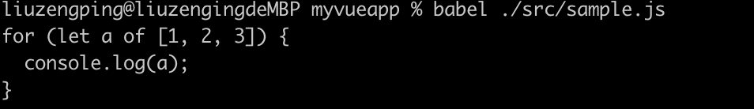

如何为我们的 JavaScript 的生产环境去制作一套工具链，来覆盖我们前端开发的各个环节。
所有的工具的开端是我们的脚手架，有的人会把脚手架误解为和工具链是同一回事，但其实并不是这样，一般来说，我们会把 generator 成为脚手架，而 yeoman，是现在社区比较流行的一个脚手架的生成器，它叫做 generators 的 generator，也就是说，我们通过 yeoman 的框架，可以轻易地去开发一个能够初始化项目的，创建模版的的工具。

## yeoman 的基本使用

### 1. creating a generator

```
mkdir toolchain
cd toolchain

npm init
npm install yeoman-generator
```

#### folder tree

```
───package.json
└───generators/
    ├───app/
    │   └───index.js
    └───router/
        └───index.js
```

#### Extending generator

index.js

```
var Generator = require('yeoman-generator');

module.exports = class extends Generator {};
```

#### Overwriting the constructor

```
module.exports = class extends Generator {
  // The name `constructor` is important here
  constructor(args, opts) {
    // Calling the super constructor is important so our generator is correctly set up
    super(args, opts);

    // Next, add your custom code
    this.option('babel'); // This method adds support for a `--babel` flag
  }
};
```

#### Adding your own functionality

```
module.exports = class extends Generator {
  method1() {
    this.log('method 1 just ran');
  }

  method2() {
    this.log('method 2 just ran');
  }
};
```

yeoman 的 API 是非常奇怪的，它会顺次地执行一个 class 里的所有方法，跟我们的认知不是特别一致。this.option('babel')，其实就是允许我们去加 babel 的 flag，这个我们暂时也用不到，可以直接删掉。

package.json 里的 main 改成`"main": "generator/app/index.js"`。

#### Running the generator

接下来退到 toolchain 根目录，尝试把示例跑起来。

```
npm link
```

执行 npm link，这个命令会把我们在本地的一个模块，link 到一个我们的 npm 的标准的模块里面去，所以可以看到它把 toolchain 的全局的模块，变成了我们开发中的模块。

```
/Users/liuzengping/.nvm/versions/node/v14.3.0/lib/node_modules/toolchain -> /Users/liuzengping/Documents/projects/Frontend-03-Template/week17/toolchain
```

link 完之后我们就可以用 yeoman 去启动它了。将 package 的名字改成 generator-toolchain，因为 package 的名字必须是 generator 开头的。重新 link 一下。

```
/Users/liuzengping/.nvm/versions/node/v14.3.0/lib/node_modules/generator-toolchain -> /Users/liuzengping/Documents/projects/Frontend-03-Template/week17/toolchain
```

执行 yo toolchain，如果未全局安装 yeoman，先`npm install -g yo`

```
yo toolchain
```

### 2. User interactions

理解了 generator 是怎样执行的以后，我们就可以为 generator 设计一个这样的流程了。它除了允许我们使用这种同步的 method 之外，也可以支持异步的 method。

接下来介绍一个非常重要的设置就是 this.prompt。log 是用于输出了，但如果我们要用户进行一些输入的话，我们就要用 this.prompt。

```
module.exports = class extends Generator {
  async prompting() {
    const answers = await this.prompt([
      {
        type: "input",
        name: "name",
        message: "Your project name",
        default: this.appname // Default to current folder name
      },
      {
        type: "confirm",
        name: "cool",
        message: "Would you like to enable the Cool feature?"
      }
    ]);

    this.log("app name", answers.name);
    this.log("cool feature", answers.cool);
  }
};
```

第一次 link 遇到的问题

提示没有安装 toolchain。
根据助教提示，跑这个命令, 看看 generator 有没有在里面
`ls $(npm config get prefix)/lib/node_modules`

全局包里有这个 generator，说明 link 是没问题的。node 版本和 npm prefix -g 都是 14.3.0，确保了 yo 是在当前的 node verison 下面去找的。
后来对照 folder tree 发现目录名 generators 被我写成了 generator，修改目录名再 link，运行 yo toolchain 就好了。

### 3. Interacting with the file system

文件系统是比较重要的功能，因为我们想要初始化一个项目的话，肯定是要跟文件去做交互的，我们需要去创建一个 template。
在 app 目录下新建 templates 文件夹，在 templates 里新建 t.html 模版。通过 this.fs.copyTpl 来复制模版，template 允许传一个 json，来替换模版中的变量。

```
class extends Generator {
  writing() {
    this.fs.copyTpl(
      this.templatePath('t.html'),
      this.destinationPath('public/index.html'),
      { title: 'Templating with Yeoman' }
    );
  }
}
```

之后新建一个空的示例，创建一个新的文件夹 demo，cd demo，yo toolchain，目标文件夹里就有了 index.html，而 index.html 里面的内容已经被填好了。这就是 yeoman 的文件模版系统，我们大部分的初始化能力都是通过它完成的。我们可以通过 prompt 去收集一些信息，我们去填写 template 的时候，它 json 的数据部分很可能来自我们的 prompt。

### 4. MANAGING DEPENDENCIES

yeoman 的依赖系统，对 npm 进行了一个简单的包装，让它用起来更舒适。可以调用 npmInstall 来创建一个依赖。

```
class extends Generator {
  writing() {
    const pkgJson = {
      devDependencies: {
        eslint: '^3.15.0'
      },
      dependencies: {
        react: '^16.2.0'
      }
    };

    // Extend or create package.json file in destination path
    this.fs.extendJSON(this.destinationPath('package.json'), pkgJson);
  }

  install() {
    this.npmInstall();
  }
};
```

执行 yo toolchain，这时候 demo 文件夹里就有了 package.json，里面包含了 eslint 和 react。也可以加一个 npmInstall 去安装依赖。this.npmInstall 可以直接执行也可以添加参数，去安装特定的包或者库。

```
this.npmInstall()
```

执行 yo toolchain，完成后依赖也被安装了，根目录包含了 node_modules 文件夹。这样初始化一个项目需要的最主要的内容已经在 yeoman 里能使用了。

## 实现一个完整的 generator

我们可以试着自己先手工初始化一个 vue 的项目，然后一步一步地去把手工做的操作放到 generator 里面，让它能够做一些我们手工做的事情，这就是所谓的脚手架。

新建 vue-demo，cd vue-demo，npm init。这个过程完全可以通过 yeoman 的 generator 来完成。

```
    async initPackage () {
        const answers = await this.prompt([
            {
                type: "input",
                name: "name",
                message: "Your project name",
              default: this.appname // Default to current folder name
            }
        ]);

        const pkgJson = {
            "name": answers.name,
            "version": "1.0.0",
            "description": "",
            "main": "generators/app/index.js",
            "scripts": {
                "test": "echo \"Error: no test specified\" && exit 1"
            },
            "author": "",
            "license": "ISC",
            "keywords": [
                "yeoman-generator"
            ],
            "dependencies": {},
            "devDependencies": {}
        };
        // Extend or create package.json file in destination path
        this.fs.extendJSON(this.destinationPath('package.json'), pkgJson);
        this.npmInstall(['vue'], {'save-dev': false})
        this.npmInstall(['webpack', 'vue-loader'], {'save-dev': true})
    }
```
执行npm link，再去vue-demo下调用yo vue，这时候初始化的项目有了package.json，也有了部分相关依赖。

添加HelloWorld.vue，从官网找一个SFC的demo。
```
<template>
    <p>{{ greeting }} World!</p>
</template>

<script>
module.exports = {
    data: function() {
        return {
            greeting: "Hello"
        };
    }
};
</script>

<style scoped>
p {
    font-size: 2em;
    text-align: center;
}
</style>
```

在generator里创建另一个方法管理模版。
```
    copyFiles () {
        this.fs.copyTpl(
            this.templatePath('HelloWorld.vue'),
            this.destinationPath('src/HelloWorld.vue')
        );
    }
```
再次执行yo vue，就出现了src/HelloWorld.vue。

接下来开始配置webpack，在webpack官网找一个简单的配置文件，修改好entry。
同时创建main.js
```
import HelloWorld from './HelloWorld.vue'
```

```
const webpack = require('webpack'); //to access built-in plugins
const VueLoaderPlugin = require('vue-loader/lib/plugin')

module.exports = {
    entry: './src/main.js',
    module: {
        rules: [
            { test: /\.vue$/, use: 'vue-loader' }
        ]
    },
    plugins: [
        new VueLoaderPlugin()
    ]
};
```

在copy的时候把它加上去。
```
        this.fs.copyTpl(
            this.templatePath('webpack.config.js'),
            this.destinationPath('webpack.config.js')
        );
        this.fs.copyTpl(
            this.templatePath('main.js'),
            this.destinationPath('src/main.js')
        );
```
再次调用yo vue，初始化之后执行webpack。会要求我们添加vue-template-compiler。
```
        this.npmInstall(['webpack', 'vue-loader', 'vue-template-compiler'], {'save-dev': true})
```

添加css-loader，包括vue-style-loader和css-loader。
```
        this.npmInstall(['webpack', 'vue-loader', 'vue-style-loader', 'css-loader', 'vue-template-compiler'], {'save-dev': true})
```

webpack运行成功，vue-demo的dist目录也有了main.js。在template里创建入口文件index.html，加在main.js的脚本。
```
<html>
    <head>
        <title><%= title %></title>
        <script src="./main.js"></script>
    </head>
</html>
```

```
        this.fs.copyTpl(
            this.templatePath('webpack.config.js'),
            this.destinationPath('webpack.config.js'),
            {
                title: answers.name
            }
        );
```

添加CopyPlugin，依赖添加。
```
        this.npmInstall(['webpack', 'vue-loader', 'vue-style-loader', 'css-loader', 'vue-template-compiler', 'copy-webpack-plugin'], {'save-dev': true})
```

webpack官网找到demo，在webpack.config.js中添加。
```
const CopyPlugin = require("copy-webpack-plugin");
module.exports = {
  plugins: [
        new CopyPlugin({
            patterns: [
                { from: "source/*.html", to: "[name].[ext]" }
            ],
        }),
  ],
};
```
注意这里执行webpack时，要用npx webpack，以防和全局的webpack版本不一致。我这里的版本是5.8.0。而全局的webpack版本是4.44.2。直接webpack总是报错The 'compilation' argument must be an instance of Compilation。并且安装时需要把webpack-cli也同时加进依赖。

### 5. Webpack基本知识
对于一个工具链来说，初始化之后，最主要的一个动作就是我们要去build它。我们更倾向于把build划分到一个独立的能力上去，因为build是可以同时为开发和发布服务的一种基础设施。webpack最初是为node设计的一款打包工具，它的能力是把一个node的代码，打包成浏览器可用的代码，所以它从最初的设计上就是一个完全针对js的一个系统，因为node的代码它并没有html的因素在，现在也出现了很多后起之秀，是基于html去打包的，这个相对来说对配置的要求就没有那么高。webpack虽然是当今最流行的打包工具，但它总是跟我们的web开发会有一些非常令人不爽的小地方，但是理解了它最初的设计背景之后，就会觉得这个其实还好，所以它一定最后要打包出来一个js文件，然后再拿html去手工地引用这个js文件，这个就是webpack的一个核心思路。
webpack能帮我们做多文件合并，在合并过程中，它可以通过各种个样的loader和plugin，去控制合并的一些规则和对文本进行一些转换。
如果想安装webpack，其实要安装两个包，第一个是webpack-cli，这个包提供了webpack的命令，第二个包就是webpack自身。所以一般来说，我们在初始化一个项目的时候，我们去安装webpack，是会把webpack-cli从webpack的依赖里去掉的。

现在很多库和node社区的习惯已经开始推荐npx了。npx不会发生二次安装的情况，本地有了webpack和webpack-cli就直接执行了。

webpack的config包含几个重要的部分：
- entry
```
  entry: './path/to/my/entry/file.js'
```
webpack其实是可以多入口的，但是其实一次webpack的整个的过程，它只支持一个文件及其所依赖的文件的打包。
- out
```
  output: {
    path: path.resolve(__dirname, 'dist'),
    filename: 'my-first-webpack.bundle.js'
  }
```
输出的文件名和输出的路径
- loader
```
module: {
    rules: [
      { test: /\.txt$/, use: 'raw-loader' }
    ]
  }
```
loader是在module的里面去进行配置的，loader其实是webpack的灵魂，我们非常熟悉的比如有babel-loader，css-loader，view-loader。loader到底是什么呢，可以看一个示例的loader.js的文件。
官网contribute -> writing a loader -> guidelines -> simple
```
import { getOptions } from 'loader-utils';
import { validate } from 'schema-utils';

const schema = {
  type: 'object',
  properties: {
    test: {
      type: 'string'
    }
  }
};

export default function(source) {
  const options = getOptions(this);

  validate(schema, options, {
    name: 'Example Loader',
    baseDataPath: 'options'
  });

  // Apply some transformations to the source...

  return `export default ${ JSON.stringify(source) }`;
}
```
这个loader其实什么都没有干，只是export了一个文件出来，这里的export，我们可以用node风格的export，也可以用最新的export语句。一个loader的使用就是把一个source，变成一个目标的代码。所以一个loader，可以认为是一个纯粹的文本的转换，而webpack会根据我们所有的转出来的import语句，或者是require函数，把它对应的文件加载进来。然后我们通过test规则，来决定什么样的后缀名的文件，使用什么样的loader。我们也可以使用多个loader去处理同一个文件，比如style-loader，它可能还会经过css-loader，sass-loader一系列的loader，把它处理进来，这就是webpack的一个核心机制，所以webpack的loader，不是plugin，我们很多时候，需要的是loader，而不是plugin。plugin它更像是一种独立的机制。

### 6. Babel基本知识
之前跟babel打交道，基本都是跟webpack的babel-plugin打交道，其实babel是完全独立于webpack的一个独立的系统，它的作用其实是把我们新版本的js编译成老版本的js。babel整个的系统比较复杂，我们先从一个全局的命令开始讲，我们全局有一个babel命令，babel命令是有一个输入和输出的，它也可以直接跟一个文件名。babel没有像webpack那样，可以一下去处理多个文件，我们必须要去用一定的脚本去调用它。

全局安装@babel/core和@babel/cli
```
npm install --save-dev @babel/core @babel/cli
```

运行babel命令：
```
babel
```
babel:
  stdin compilation requires either -f/--filename [filename] or --no-babelrc

在myvueapp的src文件夹下写一个测试文件sample.js
```
for (let a of [1, 2, 3]) {
    console.log(a)
}
```

把这个文件作为babel命令的参数
```
 babel ./src/sample.js
```
执行之后直接把原始的内容输出出来了。


如果想把它存成一个文件，就用Linux或者windows命令行特有的一种重定向标准输出的方式，一个大于号后跟一个文件名，比如输出到1.txt。
```
babel ./src/sample.js >1.txt
```
但是现在整个文件是没有被处理的，它里面的内容和sample.js一样，这是因为我们没有加任何配置。babel的配置，也有好几种加法，这里我们可以手工地指定，也可以给它存到一个特定的配置文件里。最普世的做法是添加一个babelrc文件
```
{
    "presets": ["@babel/preset-env"]
}
```
同时需要在命令行里安装presets，`npm install --save-dev @babel/preset-env`，它这里就会有各种各样的plugin，transform什么的。再重新执行`babel ./src/sample.js >1.txt`，1.txt的文件发生了变化，给它加了.babelrc之后，babel自动读取了里面的配置，并且给它转成了一个低版本的js使用。这就是babel独立使用的一个状态。
```
"use strict";

for (var _i = 0, _arr = [1, 2, 3]; _i < _arr.length; _i++) {
  var a = _arr[_i];
  console.log(a);
}
```
更多的时候我们不是独立使用，我们用的是babel-loader，也就是说，我们把babel这个工具，用于webpack打包过程中，对每个文件都执行这样的babel操作。一般来说，我们都是使用现成的presets和少数的插件，来完成我们的工作的。
