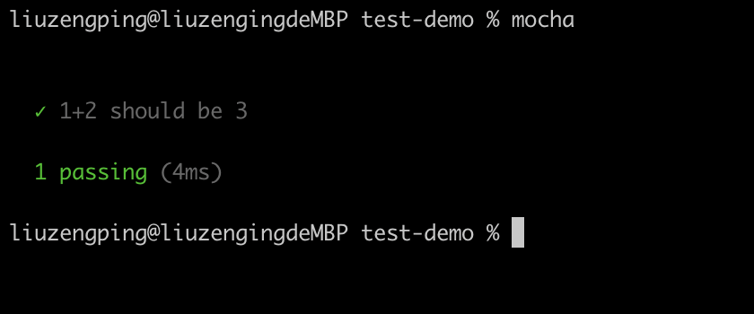
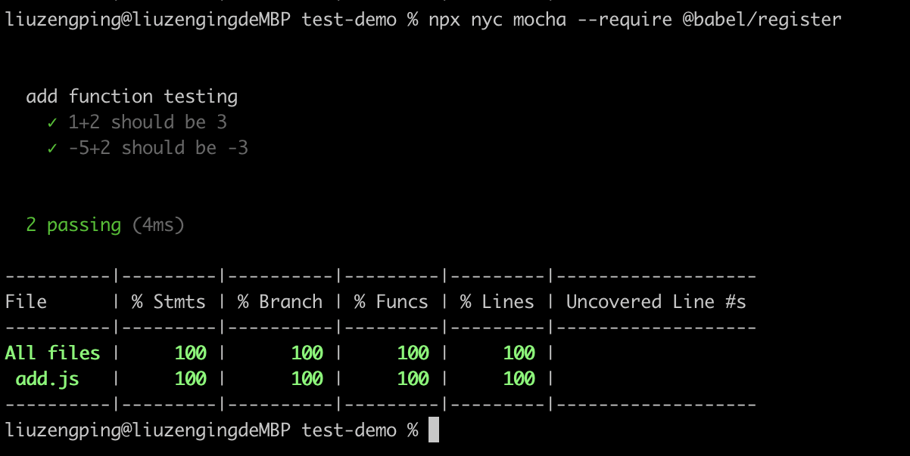
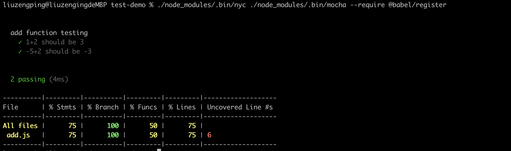
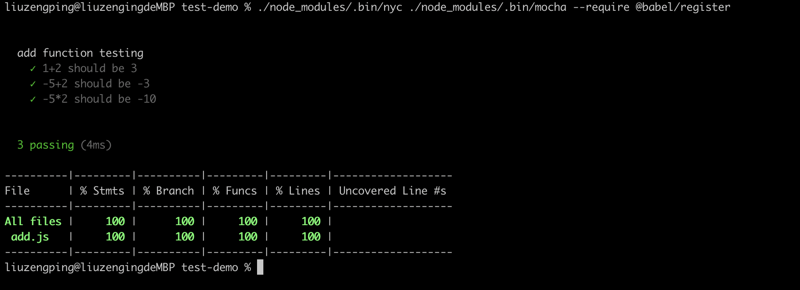
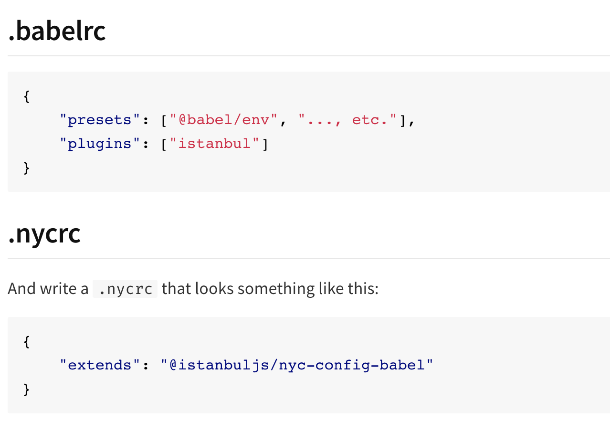
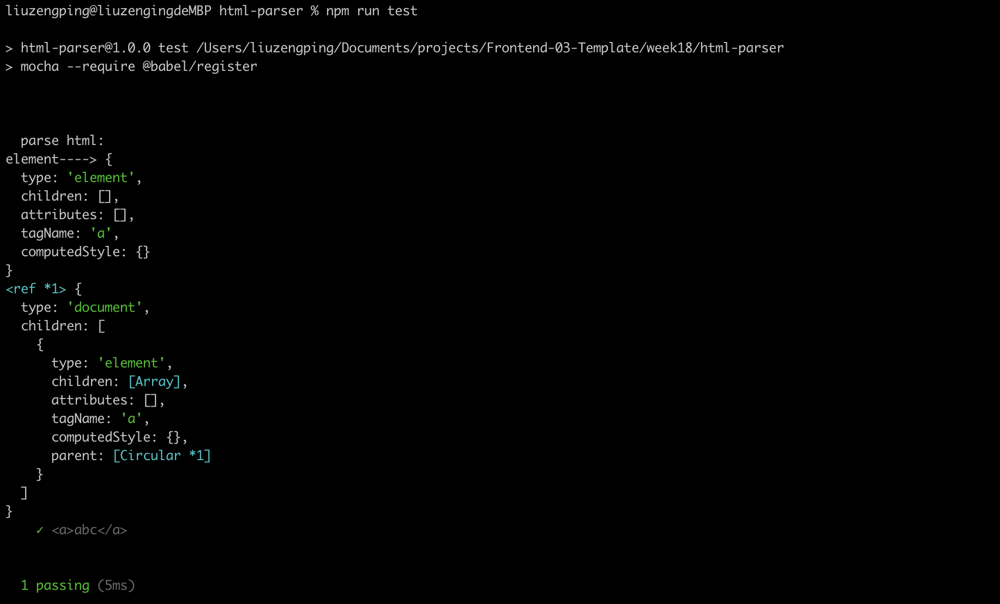
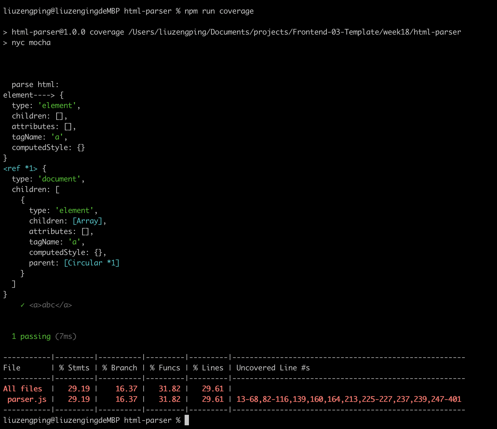

# 单元测试
## 1. Mocha
测试工具是我们供应链里非常重要的一环，对于大部分的开源项目来说，测试都是一个必需品。在公司的商业项目里面，如果你的组件或者库，是一个被高度复用的东西，那么测试的收益，也是非常高的。所以如果不是写的一次性的业务代码，尽量我们应该使用单元测试。

Mocha是现在最流行的一个库，其实它实现的内容是非常简单的。现在最流行的两个一个叫做Mocha，一个叫做jest，我们从中选一个讲一下，其实没有什么本质区别，测试框架大同小异。最重要的不是测试框架，而是coverage相关的工具。

Mocha的安装也是有全局安装和局部安装两种。
```
npm install --global mocha
```

```
npm install --save-dev mocha
```

test.js
```
var assert = require("assert");
describe("Array", function () {
  describe("#indexOf()", function () {
    it("should return -1 when the value is not present", function () {
      assert.equal([1, 2, 3].indexOf(4), -1);
    });
  });
});
```
Mocha最早也是针对Nodejs的测试框架，所以它的调用方式，默认在你使用webpack之前，它都是不支持import和export的。
describe这里是不需要的，
```
var assert = require("assert");
  it("should return -1 when the value is not present", function () {
    assert.equal([1, 2, 3].indexOf(4), -1);
  });
```
assert里面会有一些断言，比如equal就是相等的断言。测试一下1+2=3。描述为1+2 should be 3。
```
var add = require("../add.js")

var assert = require("assert");
  it("1+2 should be 3", function () {
    assert.equal(add(1, 2), 3);
  });
```
运行mocha，单元测试通过。
```
mocha
```


再加一组测试并用describe分组。
```
var assert = require("assert");

var add = require("../add.js");

describe("add function testing", function () {
  it("1+2 should be 3", function () {
    assert.equal(add(1, 2), 3);
  });

  it("-5+2 should be -3", function () {
    assert.equal(add(-5, 2), -3);
  });
});
```

add.js里为何配合使用mocha，把导出写成了`module.exports = add`，如果改成export会报错`SyntaxError: Unexpected token 'export'`，使用import也会报错`SyntaxError: Cannot use import statement outside a module`。因为export在node里默认是不能用的，除非我们把package.json改成"type": "module"，或者我们使用babel来做。一般来说改成module问题比较多，比如改成  "type": "module"就不能再使用require了，否则也会报错`require is not defined`。所以我们很少会在package.json里去改module，所以一般通过引入babel的方式。

主要问题出在export上，我们最简单的一个思路是用webpack，然后dist里面去做单元测试。但是理论上来讲，测试环节也依赖build，是一个不太好的事情。另外后面我们要做一些code coverage什么的，test如果去依赖dist里面的，那我们就又填了不少麻烦，所以我们还是尽量用一个简单的办法去解决。babel给我们提供了一个解决方案，叫做babel/register，它其实非常简单，只需要require一下就可以用了，安装babel/core和babel/register这两个模块就可以了。
调用的时候不能直接mocha，需要加参数require，把它require进来。
```
mocha --require @babel/register
```
由于这里用的是global的Mocha，所以会有MODULE_NOT_FOUND的错误，这时候需要调用local的register就可以了。最佳实践永远是调用local的工具，否则依赖当前的机器环境是一个坏习惯。
```
./node_modules/.bin/mocha --require @babel/register
```
也可以通过npx来使用本地模块。
```
npx mocha --require @babel/register
```

这个时候还有问题，因为我们用的是一个裸写的babel，它没有规定我们把它转成什么版本，需要再添加一个babel的config文件。
添加一个.babelrc并安装@babel/preset-env。

.babelrc
```
{
    "presets": ["@babel/preset-env"]
}
```
这样我们在一个新语法下把这个测试用力跑起来了。

但是如果每次都要写./node_modules/.bin/mocha --require @babel/register非常麻烦，我们可以把它放到package.json的scripts里。nodejs非常注重测试，它的scripts里面，别的命令没有，唯独留了一个test。node modules的脚本里面，它默认会把./node_modules/.bin加到自己的path里面，所以这里直接写mocha --require就可以了。
```
  "scripts": {
    "test": "mocha --require @babel/register"
  }
```

看起来mocha有些鸡肋，使用麻烦，但其实单元测试里有一个非常重要的指标，就是code coverage，这个mocha里面天然是没有的，它必须得配合其他的一些工具，接下来讲解code coverage是怎样计算的。

## 2. code coverage
我们现在写了一些test case，但是我们并不知道这些test case写的好不好，也不知道它有没有测全add.js的情况，接下来就来了解一个单元测试里最重要的概念code coverage。code coverage就表示我们的测试到底覆盖了原文件里的哪些代码，这里就要介绍一个新的工具nyc。它这个叫istanbul.js，也是一个比较重要的工具集系列。istanbul.js它的命令行工具就叫nyc。

首先安装一下nyc。
```
npm install -S -D nyc
```

测试的时候就用nyc，后边跟上我们要执行的命令。
```
./node_modules/.bin/nyc ./node_modules/.bin/mocha --require @babel/register
```
或者：
```
npx nyc mocha --require @babel/register
```
或者修改package.json后运行npm test
```
  "scripts": {
    "test": "nyc mocha --require @babel/register"
  },
```


这里它得出的结论是100%覆盖，但这里有一个问题，它其实有一个babel在干扰我们，先把它变成原来的非module.export的模式。
```
module.exports.add = add
```
```
var add = require("../add.js).add
```
测试一下不带nyc和带nyc都能正常运行
```
./node_modules/.bin/mocha --require @babel/register
```
```
./node_modules/.bin/nyc ./node_modules/.bin/mocha --require @babel/register
```
然后给add.js新加一个方法。
这时候nyc认为我们的覆盖只有50%。


这时候我们再加一个case。
```
var mul = require('../add.js').mul

  it("-5*2 should be -10", function () {
    assert.equal(mul(-5, 2), -10);
  });
```

这时候行覆盖，函数覆盖和分支覆盖都变成了100%了。一般来说，前面几个呢，也各自都有一些用处，但我们最主要的还是看行覆盖的覆盖率，因为这里的case非常简单，所以它这里算覆盖率也非常简单。这就是nyc的作用，它可以在一个复杂的文件里面，帮我们计算最终测试覆盖的比例，这是非常有用的工具。接下来试一试带上babel的情况下跑起来。


修改会import export的格式。
```
import {add, mul} from '../add.js'
```

```
export function add (a, b) {
    return a + b
}

export function mul (a, b) {
    return a * b
}
```
视频里说这里跑不起来了，但是我本地可以的。。
要想跑起来nyc需要给babel和nyc互相加一个插件，需要写一个.nycrc文件。
babel的插件叫babel-plugin-istanbul，nyc的插件叫@istanbuljs/nyc-config-babel
```
npm i babel-plugin-istanbul @istanbuljs/nyc-config-babel --save-dev
```
分别在两个配置文件里增加配置。

```
./node_modules/.bin/nyc ./node_modules/.bin/mocha
```
这时候就是根据babel的结果去算它的覆盖率了。它是有根据source map去做一个追踪的。
把nyc的代码也加到我们的命令里。
```
  "scripts": {
    "test": "mocha --require @babel/register",
    "coverage": "nyc mocha"
  },
```
我们写测试用例的时候是用npm run coverage，我们写业务代码的时候是用npm run test。这是两个不同的场景。

测试框架大同小异，nyc比较重要，code coverage非常关键。
html parser它的输入和输出都比较明确，所以说它的单元测试比较好写，以html parser为例，完整地写一下单元测试的过程。

scripts也好，dependencies也好，都可以集成到generator里，所以在工具链的结束，最终我们会把工具链里学到的所有知识，全都集成到我们的generator里面，最终generator就会变成我们工具链的一个入口。

根据上节课内容搭建测试环境，并创建parser-test.js
```
var assert = require("assert");


import {parseHTML} from '../src/parser.js'

describe("parse html:", function () {
  it("<a>abc</a>", function () {
      parseHTML("<a>abc</a>")
    assert.equal(1, 1);
  });
});
```
分别运行npm run test和npm run coverage


接下来就是通过各种方式使coverage达到100%。一般来说我们认为，单元测试能够覆盖到90%的行，100%的函数，就已经是一个比较合理的单元测试的set了。

