# 发布系统
我们的发布系统，其实分成了三个子系统，第一个是线上服务系统，它主要是给我们真正的用户提供线上服务用的。第二个就是我们程序员向线上服务系统去发布所用的发布系统，这个发布系统可以跟我们的线上服务系统同级部署，也可以跟线上服务系统是两个独立的集群，这个涉及到一定的服务端的知识，最佳实践各个公司也不太一样。课上提供的是最简单的模型，就是单机同级部署和线上服务器。最后一个子系统就是我们的发布工具，要想跟我们的发布系统相连接，我们肯定要用一个命令行工具，去跟它进行对接。

## 1. 初始化server
为了让发布系统更真实，不能在本机上跑发布系统和线上服务系统，所以我们需要一台独立的服务器来做这件事，有条件可以用真实的服务器，我们这里用虚拟机来代替真实的服务器。推荐oracle的virtual box虚拟机，可以自行搜索下载oracle VM，它是一个完全开源免费的版本。如果对Linux比较熟悉的同学，可以装自己喜欢的Linux版本，这里演示基于ubuntu server进行我们的开发。
首先我们来创造一个虚拟机，就叫做Node Server吧，系统选Linux，版本选Ubuntu 64，内存足的话分配2G，然后创建一个新的虚拟硬盘，动态分配，否则会一下占掉10G的硬盘空间。最大空间就是10G。这样我们的Node Server就创建成功了。
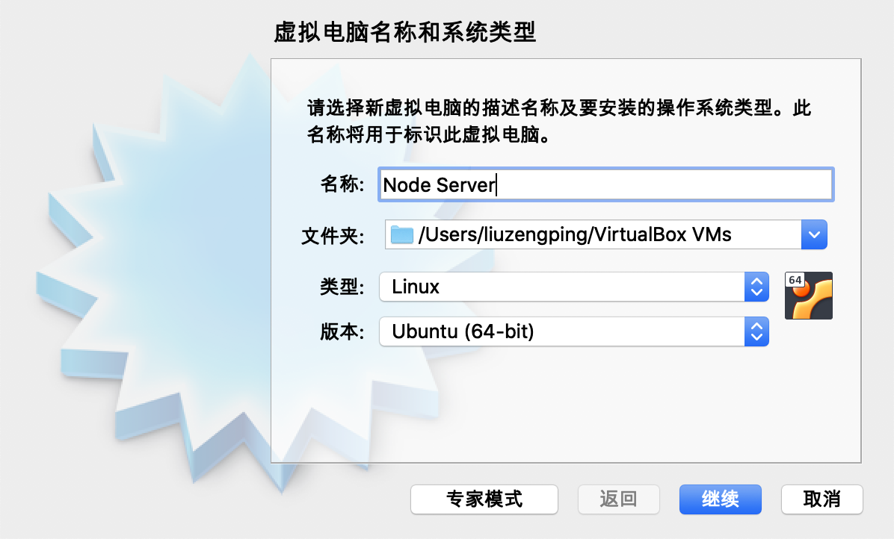
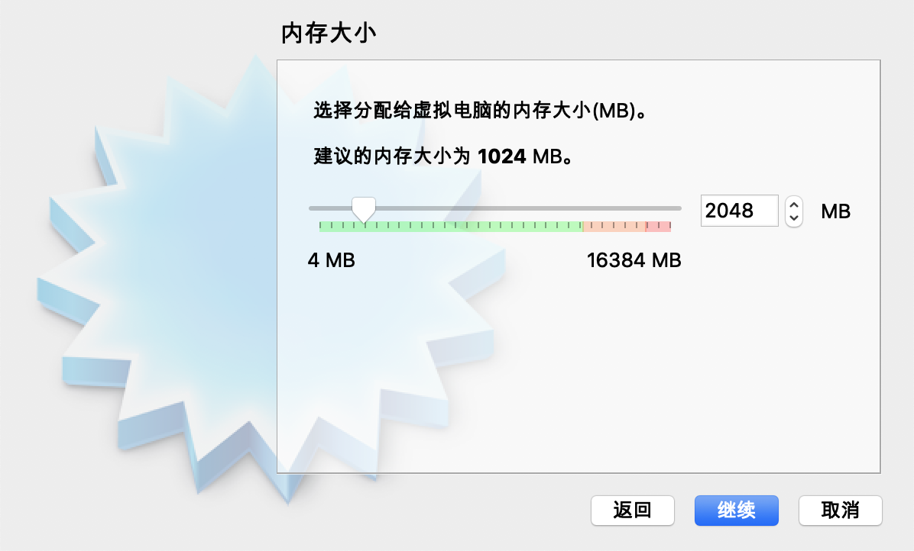
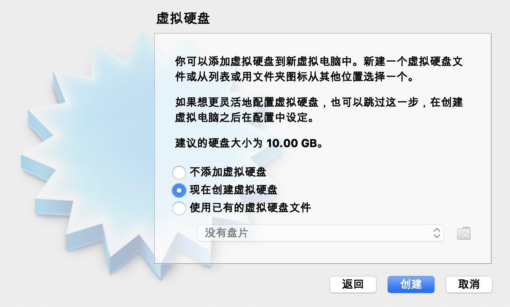
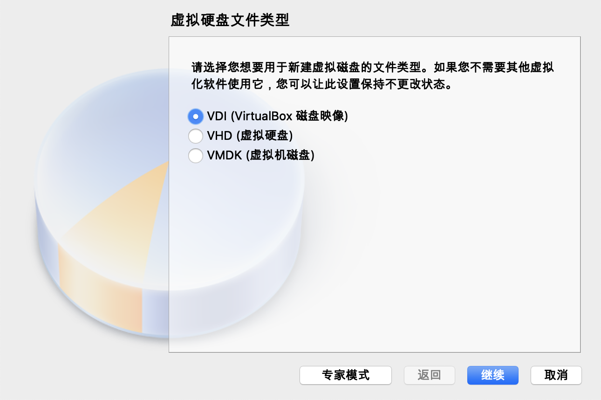
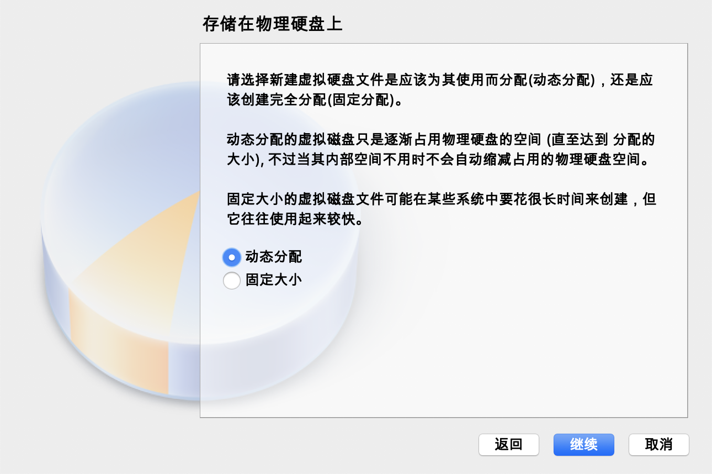
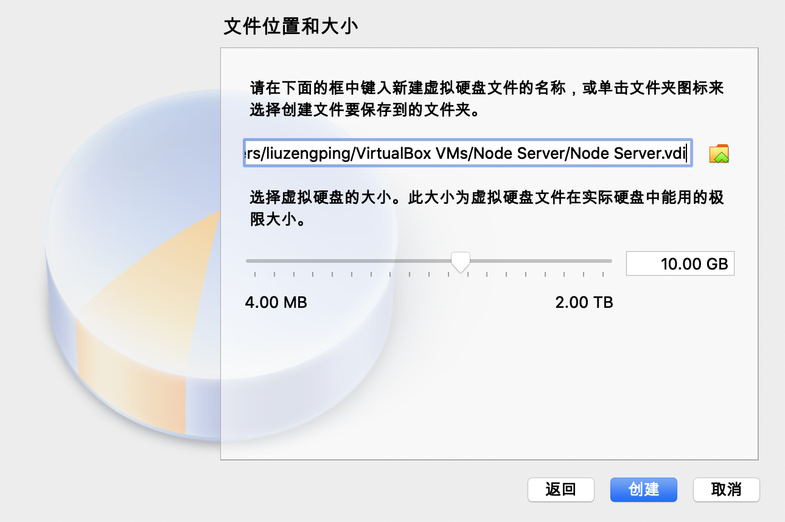
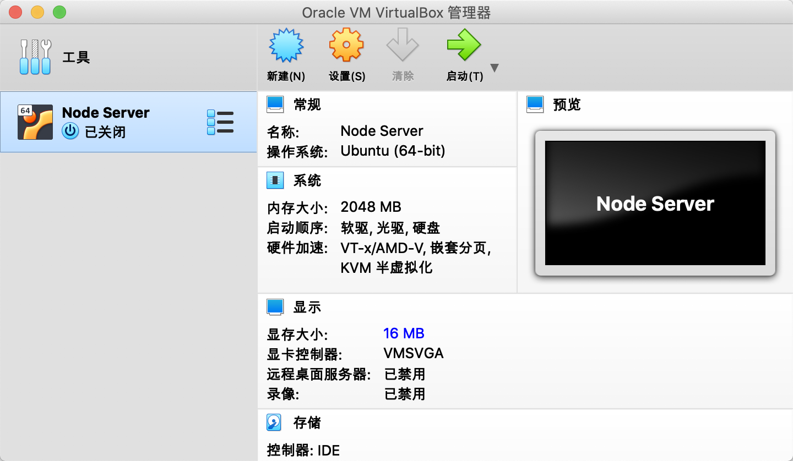
我们来把它启动起来。启动起来它会弹出提示，要我们去选一个光盘的镜像来安装操作系统，这里我已经提前下好了一个Ubuntu的20.04.1的iso版本，我们就把它下载下来，然后点start开机。语言就选英语，代理不用，注意这里的镜像地址是需要去改一下的，如果默认用ubuntu.com的地址也不是不行，但是它就是会比较慢。所以这里我们用一个阿里云的镜像地址：http://mirrors.aliyun.com/unbuntu。接下来不用动。name和server's name就写上自己。用户名和密码填完了要记住。注意Install OpenSSH server，默认要选上，剩下就可以默认安装了。安装完毕会要求我们重启，直接Reboot就可以了。重启失败，它让我们把这个光盘弹出来，它其实会自动地把光盘弹出来，然后我们再手工地重启一次就可以了。/

进入server以后，接下来安装node，我们先要把ubuntu上的包管理工具就是apt，执行一下sudo apt install nodejs。然后来安装npm，sudo apt install npm，可以通过npm --version来查看node版本，如果想要一个更新的node，我们可以安装一个叫做n的包sudo npm install -g n，这是一个node写的node版本管理，sudo n latest。这时候要求我们重新设置一下path，PATH="$PATH"。到这里为止，我们已经有了一个基本的运行Node的环境，我们的server的初始化就算完成了，接下来就可以编写代码并把代码部署到这台服务器上。

## 2. 利用Express，编写一个服务器
使用的最广泛的服务器框架Express，在实际的情况中，每个公司的线上服务系统，可能比较复杂，有的公司发展比较好的，它可能线上已经有一个这样的服务器，甚至它是一个集群形态的服务，有的公司可能是前后端混布的，就是前端写完代码，要交给后端的同学进行部署。这里不去考虑很多的情况，简单地把一个express服务器跑起来，然后把它部署到我们线上的机器上，也不去考虑监控、错误恢复、线上重启等一系列业务逻辑。一般来说，前端的代码，如果是前后端彻底分离的这种发布模式，我们的前端代码是发html的，而我们的服务端的数据，是由html和js里面做ajax请求再去获取的，这也是工作中实践较多的一种模式，所以这里我们就讲怎么去发静态文件。涉及到和服务端混布的呢，这个方案还得跟服务端同学一起去商量，前端有没有自主独立的发布权限。假设前端都是有独立的发布权限的，然后另外服务器集群的状况和部署的措施，还和运维有关，都要视公司的实际情况去进行沟通，一般不是一个前端team的事情。课程里主要是揭示里边的原理，把整个链路跑通。

新建server目录，到Express官网，getting started -> next: Hello World -> next: Express Generator，找到它generator的例子，创建express generator
```
npx express-generator
```
初始化后得到一个正常的项目目录，然后执行npm install
我们其实只用public里的代码，public里有javascripts，images，stylesheets的一些代码，我们实际上最后跑起来这个服务，就只用public里面的代码就可以了。在package.json里面，我们用npm start来启动。npm的scripts，只有叫start的时候，是不需要加run的。服务默认是在3000端口，访问localhost:3000就找到了express的服务。在app.js删掉不需要的路由和views，重新启动。
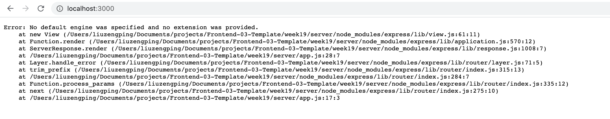
这个时候它已经找不到了，但是http://localhost:3000/stylesheets/style.css还是可以找到的。
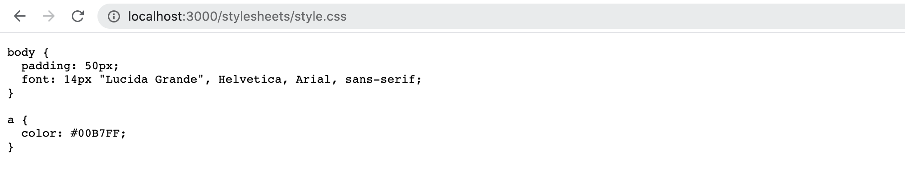
在public里创建一个index.html，访问http://localhost:3000，也可以找到

所以可以把views，routes目录都删掉，只用pubic。这就是一个简单的server了。接下来我们尝试把这个server部署到服务器。

首先要在虚拟机服务器上做一些准备，我们在安装的时候，已经装好了openSSH这个包，如果安装的时候没有加也没关系，直接apt install就可以了。我们在服务器上要先把这个服务启动起来，一般来说，默认的ubuntu服务器都是默认不启动
```
service ssh start
```
这时候它会要个auth，输入密码，我遇到了认证被拒绝的情况。后来发现是/etc/ssh/sshd_config的配置问题。
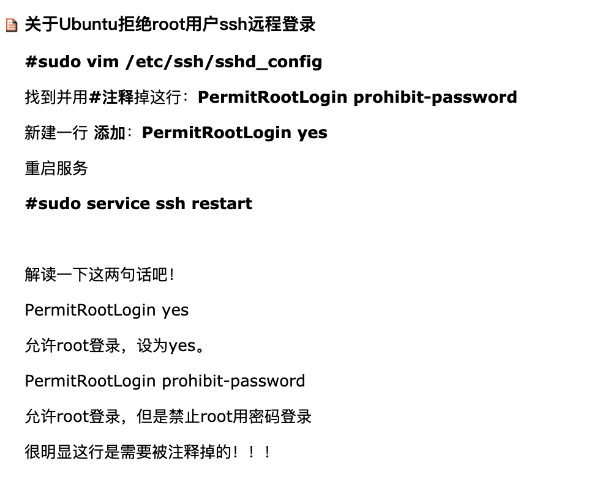
我这里默认是注释掉的#PermitRootLogin prohibit-password，通过新增一行PermitRootLogin yes解决。输入密码后显示了authentication complete。这时候ssh已经启动好了，它默认会在22端口监听，然后我们就可以远程登陆到这台server上去了。先在虚拟机创建一个server目录，mkdir server。

接下来我们来到自己的项目目录里面，ssh就是它既可以远程登陆上去，也可以传文件，这里我们用一个scp命令，scp命令在我们一般的mac电脑上都是有的，如果是别的环境可能要想办法装一下scp这个命令。我们首先要copy22这个端口，22这个端口是不会直接给虚拟机的。我们要现在虚拟机里设一下它的端口转发，settings（设置） -> network（网络） -> port forwarding（端口转发），这里面有一个端口转发的规则，添加一条记录，protocol name其实无所谓，host port随便写一个不太会冲突的port，比如8022，guest port用22，这样的话我这台`宿主机上的8022端口`，就会被转发到`虚拟机上的22端口`，我们就可以用它做登陆了。

接下来来写scp命令，大写的P代表端口，从8022端口，拷贝本目录下的所有资源，到我们的虚拟机上，虚拟机这里因为用的是同一块网卡，这里如果用的是真实的服务器的话，就根据实际的服务器IP地址来写就可以了。冒号后边是它的路径/home/alexandra/server，因为拷贝的是整个目录，所以要加-r。
```
scp -P 8022 -r ./* alexandra@127.0.0.1:/home/alexandra/server
```
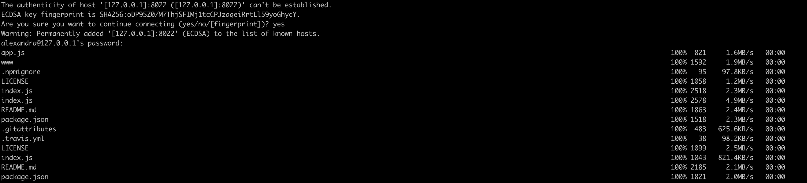

在服务器上进入server目录，通过ls命令查看是否拷贝成功。不建议在server上在进行npm install，因为包的数量非常多，难保有哪个包不遵循semantic version这个原则，你在本地调试的node module的版本，跟线上的node module的版本一致就最好了，当然这里也可以利用package-lock.json的，部署的策略就不多说了，把整个包scp上去也可以。
我们在服务器执行一下npm start，这时候它监听的是虚拟机的3000端口，需要的话可以改。还是需要再配一个端口映射，这是针对虚拟机用户的同学，每用到一个固定端口，都需要进行端口映射，这里8080映射到3000，然后我们可以通过localhost去访问它的端口了。localhost://8080得到一样的内容。http://localhost:8080/stylesheets/style.css也同样能访问。
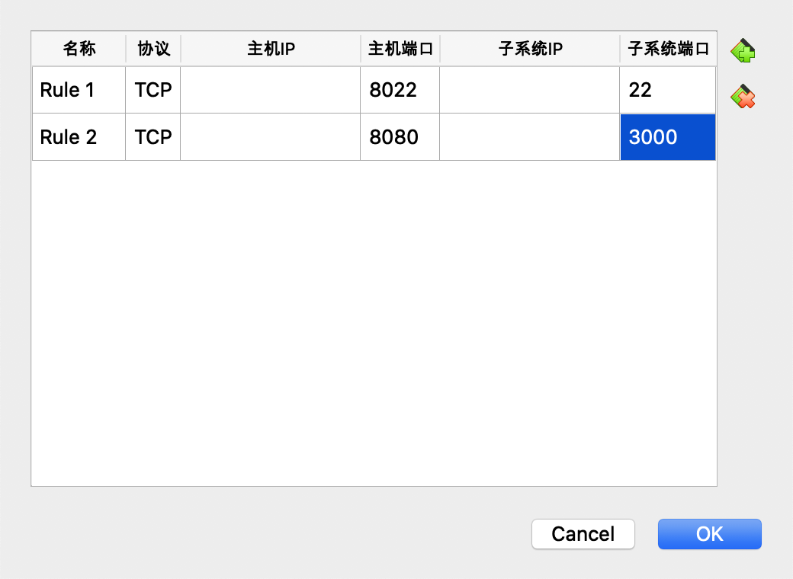

服务器这里会报一个错误Error: No default engine was specified and no extension was provided，不用管他，不影响线上服务起。这样我们就有了一个纯粹的静态服务器，它是一个比较稳定的线上的服务，这就是我们现在的一个publish server了。我们的线上服务系统，就是我们再写一个应用叫publish server，来给线上的server提供文件上去就可以了。

## 3. 用node启动一个简单的server
有了线上服务，接下来考虑如何去实现发布服务。我们发布服务，它是由一个`发布的服务器端`和一个`发布的工具`，它是由一对这样的项目来构成的。
首先创建两个新的项目，publish-server和publish-tool。publish-server负责向真实的server去copy自己的文件，向publish-server去发送我们想要发布的文件。分别npm init两个目录。这里publishe-server其实我们也可以用一个express或者koa这类比较流行的外部框架，这里由于没有多少界面上的工作，所以就用最纯粹的http API做了。
```
let http = require('http')

http.createServer(function (req, res) {
    console.log(req)
    res.end('hello world')
}).listen(8082)
```
## 4. 编写简单的发送请求功能
request是流式数据数据的写入，要给request一个end，这时候请求才真正地出去。response也是一个流式的返回。不管是客户端的request和response，还是服务器的request和response，它都是流式处理的，可能会觉得它很麻烦，但实际上我们接下来要做的正式利用流式的特性，因为我们要发布上传的东西，它可能体积未必是一个很小的东西，这时候流式处理能够帮助我们，让我们的计算机的效率达成最高。
```
let http = require('http')

let request = http.request({
    hostname: '127.0.0.1',
    port: 8082
}, response => {
    console.log(response)
})

request.end()
```
这时候一个基础代码就有了，接下来我们来添加真正的逻辑，学习一下如何通过客户端，通过请求的body，然后来传输一个文件，给到我们的服务端。

## 5.简单了解Node.js的流
发布系统需要把文件通过http传给我们发布的服务器，publish-tool到publish-server的传输，就是一个典型的流式传输。所以这里要稍微讲一下Node.js的基础知识，就是Node.js的流。因为不管是我们把文件读出来，还是最后我们走网络的request和response，以及我们最后到服务端，从服务端的request里去读数据，然后写到服务端的文件系统里面，整个的这个过程，都是需要了解流式传输的。
Node里的流分成两个部分，第一种是可读的流，也就是说我们用Nodejs的代码，从流里面可以获取数据，因为一个流一个stream，它肯定是一个对象，这个对象我们主要用的是他的两个事件，close和data。当我们得到一个流，比如说一个文件流，我们从这个文件里是逐步读取数据出来的，这个过程中，根据我们正常对stream的定义，我们是不太关心它每次读出来多少的，这个时候我们就要监听它的data event，这样data event可能被一次或者数次调用，来获取文件中的内容。这个对小文件来说没有意义，小文件可能一次读出来变成一个字符串。在Nodejs里面，对与大型文件，尤其是我们的音视频，图片之类的binary型的文件，我们最好是用这种方式去处理。data event是我们最常用的一个readable的stream里的一个事件。还有一个就是close event，我们总要知道这个流什么时候读完了。大部分可读的流我们就处理这两个部分，一个部分叫做event 的data，一个部分叫做event的close。
以读取package.json为例，在publish.js里监听data和end事件：
```
// 引入文件系统的包
let fs = require('fs')

let file = fs.createReadStream('./package.json')

file.on('data', chunk => {
    console.log(chunk.toString())
})

file.on('end', chunk => {
    console.log('read finished')
})
```
接下来看一下WriteStream。有的流是只能读，有的流是只能写，比如client端的request流，就是一个只能写的流，读不出来东西。如果一个文件可以一边读一边写，它就是一个既是readable又是writable的stream。writable的流最主要的方法就是write，还有一个end方法，对应流的结束，表示已经写完了，这个流就截止了。write不是一个同步的API，它其实是由callback的，但是我们是可以连续调用的，如果调用的时候，流本身前面的还没有写完的话，它就会排队去处理这个事情，用英文讲叫buffered。buffered就是已经给它缓存起来了。然后它会比较推荐不要不停地往流里面写东西，否则会出问题，而这个write，它会返回一个true或者false，如果是true的话可以往里写，如果是false的话，这次的write仍然是有效的，但是这个write被缓存起来了，这种时候有个事件叫drain，表示我已经把你调用write给我的数据写完了。所以说stream是个有点复杂的东西，尤其是writable stream，readable还比较简单。
这里面有一个重要的概念，就是request这个东西，它其实就是一个stream，所以为什么http的API设计成这样，就是因为它的request是一个流式处理的API，这样的话我们前面给的head的内容，是同步去处理的，但是后面的body，是以流的方式去发送的，这样就让http有了这种携带比较大型的数据的能力。我们现在习惯的都是秒级的http请求，但是对于我们的一些工具型的这种传输来说，一个request可以多传一会，传一两分钟都没什么问题。
接下来看一下怎么读取文件并把它发送到服务端。
我们要发送流式的内容，就必须把它做成post请求了，加上 method: 'POST', 和headers，headers里有个必写的内容，Content-Type，这里写成application/octet-stream，这个一个比较常见的流式传输的内容类型。http的content-type还是一个挺复杂的机制，如果想要深入了解的话，还是去看http的RFC标准。

修改publish.js和server.js
```
let http = require('http')

// 引入文件系统的包
let fs = require('fs')

let request = http.request({
    hostname: '127.0.0.1',
    port: 8082,
    method: 'POST',
    headers: {
        'Content-Type': 'application/octet-stream'
    }
}, response => {
    console.log(response)
})


let file = fs.createReadStream('./package.json')

file.on('data', chunk => {
    console.log(chunk.toString())
    request.write(chunk)
})

file.on('end', chunk => {
    console.log('read finished')
    request.end(chunk)
})
```

```
let http = require('http')

http.createServer(function (request, response) {
    console.log(request.headers)
    request.on('data', chunk => {
        console.log(chunk.toString())
    })
    request.on('end', chunk => {
        response.end('success')
    })
    // res.end('hello world')
}).listen(8082)
```
分别用debugger启动两个文件，收到了客户端的package.json的信息。我们以package.json为例，学习了流式传输，这样我们就打通了client和server端的障碍，可以传输文件了。接下来，我们把从客户端接收来的文件，通过服务端，正式地写到server里面去。

## 6. 杀掉某个node进程

一、查看指定端口的进程
sudo lsof -i :27017

COMMAND   PID    USER        FD      TYPE             DEVICE             SIZE/OFF      NODE       NAME
[mongod]  859   zhangsan    313u      IPv6            0x1111111111111     0t0         TCP        *:cslistener (LISTEN)

二、根据进程名称
ps -ef | grep nginx

  501 17780     1   0  8:36下午 ??         0:00.00 nginx: master process nginx
  501 17781 17780   0  8:36下午 ??         0:00.00 nginx: worker process
  501 17790 14611   0  8:39下午 ttys004    0:00.00 grep nginx

然后根据PID杀进程：
sudo kill -9 859

## 7. 改造server

修改publish-server的server.js
```
let http = require('http')

let fs = require('fs')

http.createServer(function (request, response) {
    console.log(request.headers)

    let outFile = fs.createWriteStream('../server/public/index.html')

    request.on('data', chunk => {
        // console.log(chunk.toString())
        outFile.write(chunk)
    })
    request.on('end', () => {
        outFile.end()
        response.end('success')
    })
    // res.end('hello world')
}).listen(8082)
```

回到客户端publish-tool，在publish-tool里新增sample.html，加一些简单的内容，然后把sample.html上传到服务端去。
```
<html>
    <head>
        <title>hello world！</title> 
    </head>
    <body>
        <h1>hellow world!</h1>
    </body>
</html>
```
server.js的文件改成sample.html。
```
let file = fs.createReadStream('./sample.html')
```
看server里public的index是否已经变成新的内容，并把服务启动起来，然后看3000端口是否变成了新的文件。然后再次修改public-tool里的sample.html，保存重启，这时候再刷新3000端口，也发生了变化。
这就是从发布工具，到发布系统，到线上系统的一个最简单的链路。
log里输出的内容变成了sample.html，再通过localhost://8080检验一下是否已经变成新的内容。


接下来把发布系统也做一个简单的部署。因为部署的工作总要做，所以把它写到npm的command里
publish-server的command
```
"publish": "scp -P 8022 -r ./* alexandra@127.0.0.1:/home/alexandra/publish-server"
```
server的command
```
"publish": "scp -P 8022 -r ./* alexandra@127.0.0.1:/home/alexandra/server",
```

需要在虚拟机上同时启动两个服务，首先把线上的server启动起来，加一个&，就不会阻塞console了。
```
npm start&
```
然后我们再创建publish-server
```
cd ..
mkdir publish-server
```
publish-server的package.json里也添加start的command
```
"start": "node ./server.js"
```
通过npm run publish把修改传到服务器，然后在服务器的publish-server目录执行npm start&。
我们由于这边用了8082端口，还是要配一个端口转发。8882->8082，这样的话，我们以后的发布服务，就到了8082这个地址了。我们也不用从本地去先调试了。
把publish-tool的地址改成8882，这个时候就是发到我们的虚拟机上。这时候我们去访问虚拟机上的地址localhost://8080，虚拟机上就会出现我们的信息。
现在大家基本上可以了解我们的发布系统是如何去工作的。下面我们将会进一步地去完善我们的publish-tool，给它加上我们的像登录鉴权，打包等一些新的功能。

## 8. 实现多文件发布
到这里我们已经实现了文件到http，又从http到文件的这种流式传输，通过对流式传输的基本学习，我们已经把我们的工具链，做成了可以单文件上传。通常在供应链里发布的环节，都不是发布一个文件，如果要发布多个文件，就需要用到node里面一些压缩相关的包。
`Archiver`包，压缩用的，
`unzipper`包，也差不多，只不过它是一个输出流。
接下来到nodejs的文档里，去学习一下流的新的知识。我们来到node文档里readable流的这里，去找一个它的重要的方法，叫做readable.pipe。pipe能够把一个可读的流，导入到一个可写的流里。我们想把一个流倒进另一个流里，我们就可以简单地一次性地调用pipe方法。
上节课的publish.js里，我们把一个文件流打开，然后把它写进了request流里面。对两个流之间的操作，其实我们有一个非常简单的方法，就是我们可以直接调用
```
file.pipe(request)
```
就可以替代之前的如下代码：
```
file.on('data', chunk => {
    console.log(chunk.toString())
    request.write(chunk)
})

file.on('end', chunk => {
    console.log('read finished')
    request.end(chunk)
})
```

```
// 把request直接倒到outFile里。
request.pipe(outFile)
```
替代：
```
request.on('data', chunk => {
    // console.log(chunk.toString())
    outFile.write(chunk)
})
request.on('end', () => {
    outFile.end()
    response.end('Success')
})
```
这里代码就非常简洁了，我们跑一下试试。首先把服务器启动起来，再把客户端publish-tool端口改成8082，8882是虚拟机线上的地址。把sample里改成hello world3，避免到时候看不清代码是否正确执行了。把代码改成pipe风格后我们运行一下，看到public里的index.html已经变成了hello world3。这个request还没有正确地结束，我们还是要加上一个file.on('end', () => request.end())。

这里我们要知道request的大小，需要先去读取一下文件的size，要用到nodejs里的fs.stat。
```
fs.stat('./sample.html', (err, stats) => {
    let request = http.request({
        hostname: '127.0.0.1',
        port: 8082,
        // port: 8882,
        method: 'POST',
        headers: {
            'Content-Type': 'application/octet-stream',
            'Content-Length': stats.size
        }
    }, response => {
        console.log(response)
    })
    
    
    let file = fs.createReadStream('./sample.html')
    
    file.pipe(request)

    file.on('end', () => request.end())
})
```
publish-server加一个log，如果收到request就说明已经正确地执行到这里了。

接下来考虑多文件的场景，多文件的场景其实我们是要把一个文件夹里的文件去压缩。新建sample文件夹，加入sample.html和cat.jpg。然后安装archiver包到dependencies。
```
npm install archiver --save
```

添加archiver的代码，并先注释掉request。执行server.js查看生成的tmp.zip文件。这样我们就知道了如何去压缩一个文件。
```
let archiver = require('archiver')

const archive = archiver('zip', {
    zlib: { level: 9 } // Sets the compression level.
});

archive.directory('./sample', false)

archive.finalize()

archive.pipe(fs.createWriteStream('tmp.zip'))
```

而且它既然能pipe到文件流里，它同样能pipe到request流里面。我们就把它pipe到一个request流里面，看看服务端能不能正确地接收这个文件。
```
let outFile = fs.createWriteStream('../server/public/tmp.zip')
```
server里有了tmp.zip，解压了也是正确的内容。这说明我们在传输的环节已经没有问题了。

接下来我们在服务端去把它解压。解压的过程就需要用到另外一个包unzipper。在publish-server上安装这个包到dependencies。
```
npm install unzipper --save
```

```
request.pipe(unzipper.Extract({path: '../server/public'}))
```
执行server.js，文件被解压到pubic目录。

# 9. 用GitHub oAuth做一个登录实例

到这里我们已经掌握了通过压缩包进行多文件上传和把它部署到我们的线上服务的能力，但是我们不能允许所有人，谁上传一个压缩包就把它部署掉，我们还涉及到一个鉴权的问题，因为要鉴权，所以我们需要一个登录。今天我们大多数的时候，都是走oAuth的技术去登录的。这里以GitHub的oAuth为例，做一个oAuth登录的实例。

我们要怎样才能创建一个GitHub登录的权限呢，根据GitHub的文档，要先到settings里去创建一个新的app，settings -> Developer settings -> new Github App

GitHub App name就用alex-toy-publish，Homepage URL是http://localhost或者http://127.0.0.1，User authorization callback URL写成http://localhost:8082/auth，然后下面大部分是不用改的，Expire use authorization，用户登录的token要不要过期，这里我们一般选择不用过期，因为我们安全性要求没有那么高。Webhook我们是不需要的，Post Installation我们也是不需要的，Where can this GitHub App be installed? 最终正式做的话会选择any account。

创建成功，它会建议我们generate a private key来安装我们的GitHub app。我们可以点击generate a private key，下载的pem文件是用在local环境下的。但其实我们没有必要安装，我们只需要用它的登录就可以了。用这里的client ID和client secret就够了。

我们看一下GitHub oAuth的API，打开GitHub的文档，来了解一下oAuth整个的流程，https://docs.github.com/en/free-pro-team@latest/developers/apps/identifying-and-authorizing-users-for-github-apps

1. Request a user's GitHub identity
首先我们要跳转到这个页面进行登录
```
GET https://github.com/login/oauth/authorize
```

2. Users are redirected back to your site by GitHub
它会给我们返回一个code，我们拿着code去这个网址换access token，这个过程一定是服务端执行的。
```
POST https://github.com/login/oauth/access_token
```

3. Your GitHub App accesses the API with the user's access token
我们拿着access token，带上authorization这个头，就可以去访问user的信息了，这个整个过程中，我们需要我们的publish-server和publish-tool各自完成其中的一部分。
```
Authorization: token OAUTH-TOKEN
GET https://api.github.com/user
```

这个authorize的网址，只要让它带上我们的client_id，就可以访问我们的信息了。
```
https://github.com/login/oauth/authorize?client_id=Iv1.509dbf8bb5da1040
```

但是它在登录成功以后会跳转到这个页面，这个页面我们还没有写，这个过程就应该是由我们的publish-server去保存的
```
http://localhost/auth?code=27599aee5c27b6526bb8
```

我们的publish-server拿到了这个code以后，我们就可以调用第二部的API，需要用到我们的client_id，client_secret和code，这个调用了之后，因为我们的client_secret只能保存在publish-server里面，我们不可能把它下发到所有的客户端，那这个就要被偷走了，然后这个时候，我们就访问到了code的信息，我们就把code换成了一个token，拿着这个token，我们就可以调用任何一个GitHub的API了，这个是他的整个过程。