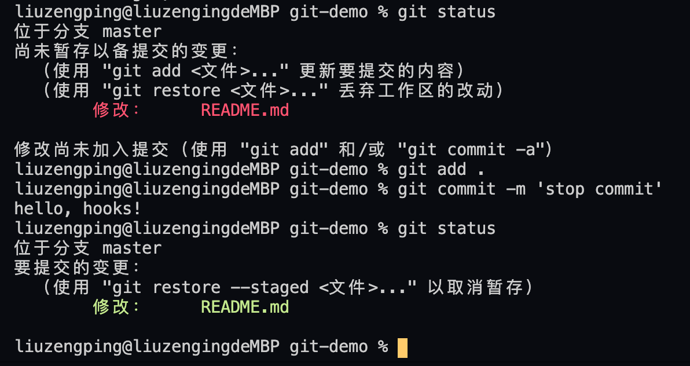

# 持续集成
## 1.发布前检查的相关知识
我们有了发布系统之后，就要考虑持续集成的问题了。在前端领域持续集成，跟传统讲的持续集成，它是有一定区别的，持续集成这个概念，是由客户端工程师提出来的，客户端工程师讲持续集成，其实是对于一个最终阶段集成的概念提出来的。前面各自开发，最终集成联调。这种模式，是在持续集成这个理念提出来之前，客户端主要的一种开发模式。而持续集成这个概念，就打破了这种模式，它提出了两个特别重要的概念，第一个概念叫`daily build`，它会通过服务端的代码，让它在每天晚上的时候，进行一次全局的build，看看今天的daily build是否成功，如果没成功，就把今天所有的提交记录，挨个拉出来打一打，看看是谁break了daily build。还有一个概念叫BVT，build verification test，就是构建的验证测试，它其实是一种冒烟测试，所以它的case，都是最基本最简单的case，这些case一旦不通过，说明这次build基本就是废的，这个其实就是对我们build成功之后的东西，做一个基本的验证。即使build通过了，这个东西可能一上来就白屏黑屏也不行，所以就会有一个BVT的概念。这两个东西共同支撑起了客户端的持续集成的体系。
而到了我们前端，事情发生了一些变化，首先我们的前端build一次，大概是多长时间，多的可能两三分钟，少的几十秒，这个过程是非常快的，所以我们不用搞得那么隆重，daily build我们完全可以变成一个更短的时间线范围内，当然了，这个时间，它不一定短到说我们就hourly build，secondly build，这个没有必要。我们可以选择在提交的时候，去进行一下build和基本的验证。说到基本的验证，我们前端的BVT也有一定的变化。对客户端软件来说，它的开发周期可能是以月计的，2到3个月，这是属于比较短的，长的呢，可能十几个月，前端基本上是以周计这样的时间，一周两周这是一个比较正常的上线周期，短的做几个小时上线到三天上线，这个区间也是有的，这个时候，我们就要考虑一下，我们再去搞BVT，还划不划算。其实在客户端时代，BVT都是由我们的测试工程师来提供的，因为BVT是属于end to end的测试，所以说它涉及一些UI上面的操作，所以一般来说，我们的单元测试是没有办法覆盖的。正因为我们的测试工程师，他产生case的成本是非常高的，所以说对于前端这种短周期的开发来说，可能就不太合适了，所以我们的前端工程师也是会想到一个变通的方法，就是采用一种更轻量级的检查方式。我们知道最轻量级的检查方式就是lint，只是对代码风格和一些常见的代码的模式，做一些校验。而我们前端要想做一个比较完整的测试，那么我们可以使用phantomJS这样的无头浏览器去进行测试。我们去做持续集成，可以利用无头浏览器，把整个DOM树生成起来，然后我们检查DOM树里面特定的某些格式，因为DOM树里面我们可以通过CSSOM拿到元素的位置，也可以看到背景图，也可以拿到元素的一些结构，所以我们客观上，使用无头浏览器，是可以配合一些规则校验，最后完成我们的BVT的任务的。比如淘宝就用BVT来检查一些性能上常见的反pattern，比如说图片过大，图片面积跟图片质量不成比例，这种时候我们就会通过无头浏览器，把这种问题都抓出来。所以接下来重点介绍三个知识，第一通过Git Hooks来完成检查的时机，然后就是eslint，一种非常轻量级的代码检查方案，然后就是phantomJS，基于无头浏览器，对代码最终生成出来的样子，做一些规则的校验和检查，
## 2. Git Hooks的基本用法
这里我们要用到的主要是client-side Hooks，其实client-side Hooks，已经悄悄存在于我们每一个Git仓库里了，我们就来带着大家认识一下Git Hooks
```
mkdir git-demo
cd git-demo
touch README.md
git init // init之后已经是一个git的repo了
git add README.md 
git commit -a -m 'init' // 进行一次commit
git status // 提交成功后status是干净的
git log // 可以看到这次init的提交
```
接下来看一下git的文件夹里有什么，通过`ls -a`就能看到隐藏的.git文件夹，然后我们通过`open ./.git`把它在文件管理器里打开，这个.git文件夹，不论在我们的编辑器里，还是在我们的默认的文件系统里，它都是不显示的。

这里面就藏着一些我们要的git hooks，打开.hooks文件夹，可以看到所有的hook，其实都是以.sample结尾的，以sample结尾，意思就是说，它并不会实际地执行，但是只要我们把.sample去掉，它就变成了一个可执行的东西。这个是一个Linux的可执行文件，它遵循了基本的bash规则，这是用shell脚本写的，当我们把sample去掉的时候，它就变成了一个pre-commit的hook，而看到这里面其实所有的hook的名字都已经在这里了，而这里面其实我们最重要的就是pre-commit和pre-push这两个钩子在客户端上，如果我们要在服务端做git的处理，我们就去用pre-receive这个钩子。

这里我们可以先试一下pre-commit，因为commit是一个比较常见的一种操作，一般来说，我们会把lint之类这样的操作，放到pre-commit里，然后我们会把最终的check操作放到pre-push里。这里我们先去了解commit和push这两个钩子，pre-commit这个钩子呢，用的是我们不喜欢的语言，没有关系，我们可以把它变成node。
```
which node
```

我们在hooks文件夹里先新建一个pre-commit文件
```
cd .git
cd hooks
ls -l pre-commit
// -rw-r--r--  1 liuzengping  staff  0 12 23 20:02 pre-commit
```
然后用ls -l命令去看pre-commit，我们看到它只有rw的权限，所以说，我们需要给它改变一下权限，否则这个文件是不能用来执行的，比如我们执行`./pre-commit`，会得到permission denied。

我们用chmod命令给它把执行的权限加上，`chmod +x pre-commit`，x就是执行，这个时候我们再用ls -l命令去看pre-commit，会发现所有用户都给加了执行的权限，这时候我们的pre-commit就变成有执行权限的了。
```
chmod +x pre-commit
ls -l pre-commit
// -rwxr-xr-x  1 liuzengping  staff  0 12 23 20:02 pre-commit
```
接下来我们来编写pre-commit的内容，这里面我们不想像sample一样，用shell脚本去做pre-commit的内容，当然我们肯定想用自己喜欢的node了，这个是类Linux系统，它都有的一个习惯，就是可以通过井号叹号来标注这个文件是用哪个脚本引擎执行的。我们需要使用当前的环境，就是/usr/bin/env这个东西，之后传我们想要的命令参数，就是node。我们打印一个hello hooks出来
```
#! /usr/bin/env node
console.log('hello, hooks!')
```
执行`./pre-commit`，就可以看到hello, hooks!被打印出来了。这时我们退出hooks文件夹，我们在git-demo里稍微对代码做一下修改，给README.md文档添加一个标题 # A Sample Change，做一次提交
```
git add .
git commit -m 'A Sample Change'
```
我们看到在git的hooks这个位置，执行了hello, hooks！这说明我们的hooks被正确地执行了。

那么hooks是否可以阻止我们不想要的提交呢，我们可以用node的process模块
```
#! /usr/bin/env node
let process = require('process')
console.log('hello, hooks!')

process.exit(1)
```
这里hooks就可以阻止提交。再次修改README.md并提交

调用了commit命令，但是并没有git的提交的输出的字样，在看git status也依然是修改状态，说明我们的提交被hooks拦了下来。那么如何进行有条件的拦截呢，这个就可以放到我们对hooks的修改的逻辑里面了。
## 3. ESLint基本用法
js代码的一些轻量型的检查工具，eslint非常有名，也是业内基本都在用的代码风格检查。
```
mkdir eslint-demo
cd eslint-demo
npm init
npm i -S -D eslint
npx eslint --init
```

创建一个新的文件随便写点什么，让它lint一下看看
index.js
```
let a = 1
for (let i of [1, 2, 3]) {
    console.log(i)
}
```

看到eslint发现了一个问题，认为'a' is assigned a value but never used。这就是eslint的基本用法。
## 4. ESLint API及其高级用法
我们要想在git hooks里调用eslint，最好不要去直接调用它的命令行，所以我们来学习下eslint的API
首先是创建一个instance，fix千万不要写true，如果git commit的时候给fix了一下，这个场景万一出点什么问题，开发者不认账都要算到开发工具的人的头上。第二步非常简单，就是调用lintFiles API，然后它就能够去找到我们所有需要的js的文件，然后把它lint掉。我们可以跳过第三步，然后直接到第四步，给它format一下。最后我们把结果输出。
[nodejs-api](https://eslint.org/docs/developer-guide/nodejs-api)
```
#! /usr/bin/env node
let process = require('process')

const { ESLint } = require("eslint");

(async function main() {
  // 1. Create an instance with the `fix` option.
  const eslint = new ESLint({ fix: false });

  // 2. Lint files. This doesn't modify target files.
  const results = await eslint.lintFiles(["index.js"]);

  // 4. Format the results.
  const formatter = await eslint.loadFormatter("stylish");
  const resultText = formatter.format(results);

  // 5. Output it.
  console.log(resultText);
})().catch((error) => {
  process.exitCode = 1;
  console.error(error);
});
```
修改pre-commit。然后在git-demo中，初始化项目，安装配置eslint。添加.gitignore
```
npm init
npm install eslint -S -D
npx eslint --init
```
新建index.js，并添加一些代码，
```
let a 
for (let i of [1, 2, 3]) {
    console.log(i)
}
```
执行commit，检查出来了问题，但是它还是提交了，因为result里面的错误不算错误，我们到hooks里再修改一下。看一下eslint.lintResult的返回值，LintResult type，这里有一个非常重要的是errorCount，循环results，如果有errorCount就退出。
```
  // 5. Output it.
  console.log(resultText);
  for (let result of results) {
      if (results.errorCount) {
          process.exitCode = 1;
      }
  }
```

在稍微修改一下index.js，这时就阻止了commit，如果把let a = 1去掉，不报错，就能成功提交了。这就是git hooks和eslint一个基本原理。这样我们就了解了git hooks的基本工作原理，但是接下来我们要处理一个边界情况，在for循环的数组里加一个4，
```
for (let i of [1, 2, 3, 4]) {
    console.log(i)
}
```
这时候git status，出现的是红色的index.js，git add之后变成绿色的index.js。
```
let a 
for (let i of [1, 2, 3, 4]) {
    console.log(i)
}
```
但是其实我对它进行再次编辑加上let a，然后你会发现，它出现了一绿一红两个index.js，它其实是同一个文件，现在呈现出来的，其实是标红的这个change。这个跟git的机制有关，这个时候如果我commit，是绿色的这个版本，也就是不带let a的版本，因为当前版本还没有add。但如果我们执行git commit -m 'add var a'，这个时候你会发现它检查的是我们当前的版本。

那么怎么才能把我们当前的工作不要去做，能够让它最终检查的是我们将要提交的那个版本呢，这个时候就涉及到我们git的一个概念，因为ESlint，它就只管当前目录里的所有文件，它才不管什么git不git的，git的所有变化对它来说都是透明的，所以我们需要用git本身的机制，把当前目录变成一个它可以去检查的东西。我们需要用到一个git比较高级的命令`git stash push`，它就会给我们创建一条git stash命令，文件会切换到这个状态。
```
for (let i of [1, 2, 3, 4]) {
    console.log(i)
}
```
然后我们可以用git stash list来查看， 它就会有一条新的记录。然后再给它git statsh pop，文件会切换回去。
```
let a 
for (let i of [1, 2, 3, 4]) {
    console.log(i)
}
```
再git status查看。

但是这个里面也有一个问题，就是我们发现我们的两次更改，又被合并成了一次，但是stash它是有一个办法去解决的。我们手动去掉let a，之后add，再查看status，这时候绿色的index.js又出现了，然后我们再做一个变更，加上let a，git status查看又是一绿一红了，这个时候我们给它git stash push -k，这时候我们会发现文件恢复后到没有let a的状态后，绿色的变更依然存在，这个时候我们去调用eslint，npx eslint ./index.js当然它就能通过了，而且这个也是我们实际上要提交的东西，然后我们去提交也提交成功了。但是我们如何把之前做的红颜色的更改又加回来，这个时候我们git stash pop就可以了，这时候可能会出现一些它认为的冲突，我们去解决一下冲突就可以了。解决冲突commit时它同样需要遵循我们的规范。
```
<<<<<<< Updated upstream
=======
let a
>>>>>>> Stashed changes
for (let i of [1, 2, 3, 4]) {
    console.log(i)
}
```
我们可以用child process去放到hooks里面去执行git stash的命令，当然也可以让我们的用户，去学习一下git stash这个命令。我们试着把它实现到我们的hooks里面。

exec是一个回调风格的代码，我们需要先写一个promise版的exec。
```
const { ESLint } = require("eslint");

function exec (name) {
    return new Promise(function (resolve) {
        child_process.exec(name, resolve)
    })
}

(async function main() {
  // 1. Create an instance with the `fix` option.
  const eslint = new ESLint({ fix: false });

  // 2. Lint files. This doesn't modify target files.
  await exec('git stash push -k')

  const results = await eslint.lintFiles(["index.js"]);

  await exec('git stash pop')

  // 4. Format the results.
  const formatter = await eslint.loadFormatter("stylish");
  const resultText = formatter.format(results);

  // 5. Output it.
  console.log(resultText);
  for (let result of results) {
      if (result.errorCount) {
          process.exitCode = 1;
      }
  }

})().catch((error) => {
  process.exitCode = 1;
  console.error(error);
});
```
git hooks和eslint这样一个有效的结合，可以有效地帮助我们去管理我们代码的统一的质量，这就是我们持续集成系统的一个重要组成部分。另外可以提一点，我们的服务端的git系统，多数提供了一个web hooks的能力，这个web hooks的能力，它不是git本身的能力，它是像一个GitHub，gitlib这样的一个包装，他们的格式一般也不一样，所以需要根据实际情况去获取它们的API。在实际过程中，其实web hooks也是用的比较多，服务端检查具有一定的强制性。
## 5. 使用无头浏览器检查DOM
使用无头浏览器做一些发布前的检查，之前用的是phantomJS，但是经过一段时间的调研，我们发现phantomJS已经过于老旧，不适合现在的新的环境了。chrome推出了一个headless的模式，这个是现在比较推荐的最佳实践。chrome的headless的模式是在chrome命令执行之后，后面加headless参数的。首先我们需要在mac或者Windows下给它加上chrome这样的快捷方式，这样我们就可以直接通过chrome命令来调起一个新的浏览器的窗口了，给它加上--headless它就是一个无头浏览器了，给它加上--dump-dom，把这个dom树打印到我们的屏幕上，这个不是源代码，这个是执行过后的dom。我们也可以把它输出到一个文件里，当然我们也可以用node的child_process去获取它，但是如果我们用node去调用它，我们有一种更简单的方式，chrome它推出了一个[puppeteer](https://github.com/puppeteer/puppeteer)的库，这个就是一个非常好的代替phantomJS和命令行的一种方式，它是命令行的一种简单的封装。它的API也是完全遵循了最新的async await的风格的一个API。我们来试验一下

首先我们来到以前已经开发过的component，
```
npm install -S -D puppeteer
```
将例子拷贝到main.js并做对应修改。
```
const puppeteer = require('puppeteer');

(async () => {
  const browser = await puppeteer.launch();
  const page = await browser.newPage();
  await page.goto('http://localhost:8080/main.html');
  const a = await page.$('a')
  console.log(await a.asElement().boxModel())
})();
```
我们可以利用puppeteer的dom的能力，进行一些代码的规则检查，比如说我们可以把它的图片取出来，可以把它的各种不同的内容取出来， const imgs = await page.$$('a')，两个$就是取img，执行，它取出了四个img，然后我们可以取它的位置，取它的内容什么的。这就是我们无头浏览器的一个基础知识，应用进git hooks里的原理，和lint是完全一样的。基于lint和无头浏览器，我们就可以构建一个非常强有力的持续集成的体系，来帮助我们去保证项目的基本质量。我们还可以把lint和无头浏览器放到服务端去执行，这样就变成了一个强制标准，放到客户端它就是辅助工具。